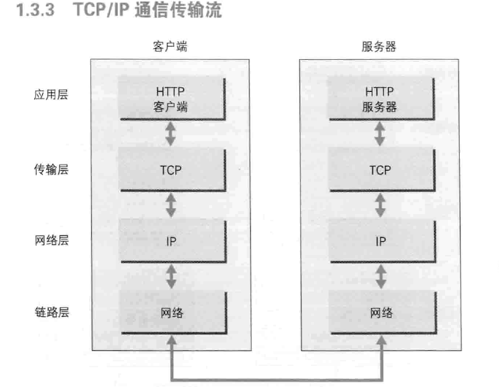
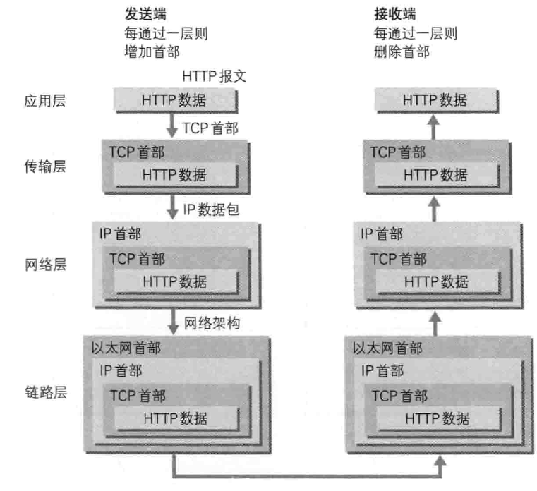
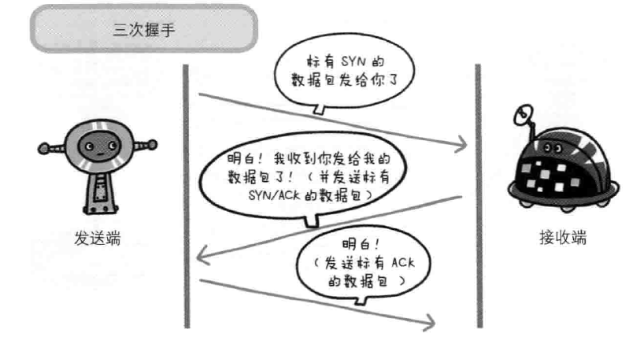
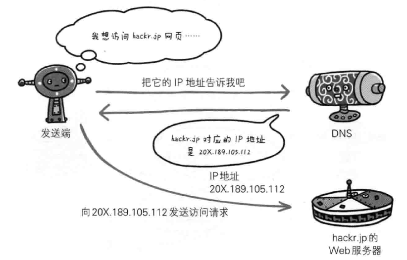
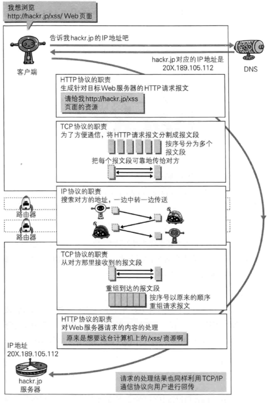

### 网络基础TCP/IP
	通常使用的网络（包括互联网）是在tcp/ip协议集的基础上运作的。而http（是一个应用层协议）是它内部的一个子集。
	TCP提供了：
		* 无差别的数据传输
		* 按序传输（数据总是会按照发送的顺序到达）
		* 未分段的数据流（可以在任意时刻以任意尺寸将数据发送出去）
#### TCP/IP的分层管理 ([OSI七层和TCP/IP四层](https://blog.csdn.net/wxb880114/article/details/82751680))
		http             应用层
		tcp              传输层
		ip               网络层
		网络特有的链路接口   数据链路层
		物理网络硬件        物理层
名称|名字|作用
--|--|--|
http|应用层|应用层决定向用户提供应用时通信的活动。TCP/IP协议集预存了各类通用的应用服务。如：FTP(fail Transfer Protocol，文件传输协议)和DNS(Domain name System, 域名系统)服务就是两类。HTTP协议也在该层
tcp|传输层|传输层对上层应用层提供网络链接中两台计算机之间的数据传输。在传输层有两个性质不同的协议：TCP(Transmission Control Protocal,传输控制协议)和UDP(User Data Protocal,用户数据报协议)
ip|网络层|网络层用来处理在网络上流动的数据包，数据包是网络传输的最小数据单位。该层规定了通过怎样的的路径（所谓的传输路线）到达对方计算机，并把数据包给到对方
网络特有的链路接口|数据链路层（网络接口层）|用来处理链接网络的硬件部分。包括控制操作系统，硬件的设备驱动，网络适配器即网卡，及光纤等物理可见部分
物理网络硬件|物理层

#### 与HTTP密不可分的协议：IP、TCP和DNS
##### 负责传输的IP协议
	所有的网络系统都会用到IP协议。TCP/IP协议中的IP就是指的是网际协议，'IP'是一种协议的名称（不要把IP和IP地址搞混了）
	IP协议就是把各种数据包传送给对方。而要保证确定传送到对方那里，则需要满足各种条件。其中两个重要的条件是IP地址（是指节点被分配到的地址）和MAC地址（指的是网卡所属的固定地址）。ip地址可变，但MAC地址基本上不会更改。
##### 确保可靠性的TCP协议
	提供可靠的字节流服务。所谓的字节流服务是指，为了传输方便，将大块的数据分割成报文段（segment）为单位的数据包进行管理。而可靠的传输服务是指，能够把数据准确可靠的传给对方。TCP协议为了更容易传送大数据把数据分割，而且TCP协议能够确认数据最终是否送达到对方。
	数据送达到对方：
		为了精准将数据送到目标处，TCP协议采用三次握手（three-way handshaking）策略。用tcp协议把数据包送出去后，它会向对方确认是否成功送达。握手过程中使用了tcp的标志（flag）--SYN(synchronize)和ACK(acknowledgement)

##### 负责域名解析的DNS服务
		它提供域名到IP地址之间的解析服务.DNS协议提供通过域名查找IP地址,或逆向从IP地址反查域名的服务.

