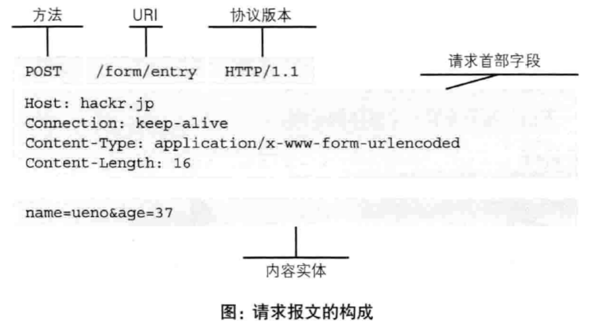

#### HTTP协议
	HTTP协议和其他TCP/IP协议集内的其他众多协议相同，用于客户端和服务端之间的通信。
	请求文本或图像资源的一端成为客户端，而提供资源相应的一端称为服务端。

	2.2通过请求和响应的交换达成通信
		http协议规定，请求从客户端发出，最后服务端响应请求该请求并返回。

		
	起始行开头的GET表示请求访问服务器的类型,称为方法(method).随后的字符串/index.html指明了请求访问的资源对象,也叫请求url(request-url).最后的http/1.1即http的版本号.用来提示给客户端使用的http协议功能.
	综合来看.这段请求内容的意思是:请求访问某台服务器上的index.html的资源.
	请求报文是由请求方法(GET,POST),请求url(),协议版本(http/1.1),可选的请求首部字段和内容实体构成的

		
	响应报文由协议版本,状态码(表示请求成功或者失败的数字代码),用以解释状态码的原因短语,可选的相应首部字段和内容实体构成.

	2.3 HTTp是不保存状态的协议(无状态协议)
		http协议自身不对请求和响应之间的通信状态进行保存.
		http1.1虽然是无状态协议,但为了实现期望的保持状态功能(购物网站,登录,跳转到别的页面,也要保持登录状态.这个是需要保存状态的),于是引用了Cookie,有了cookie在用http协议通信,就可以管理状态了.
	2.4 请求url定位资源

	2.5 告知服务器意图的http的方法
		GET:获取资源

		POST:用来传输实体的方法(GET虽然也可以,但一般不使用)
			POST主要目的并不是获取响应的主体内容

		
		PUT:传输文件(用于传输文件,就像FTP协议的文件上传一样,要求在请求报文的主体中包含文件内容,然后保存到请求的URL指定的位置)
		HEAD:获得报文首部(HEAD和GET一样,只是不返回报文主体部分,用于确认URL的有效性和资源更新的日期时间等)
		
		DELETE:删除文件(与PUT相反,DELETE是请求URL删除指定的资源)

		CONNECT:要求用隧道协议链接代理
			CONNECT方法要求在与代理服务器通信时建立隧道,实现用隧道协议进行TCP通信.主要用于SSL(Secure sockets Layer, 安全套接层)和TLS(Transport larer Security,传输层安全)协议把通信内容加密后经网络隧道传输.
	
	 2.7持久连接节省通信量

- 第一次握手：起初两端都处于CLOSED关闭状态，Client将标志位SYN置为1，随机产生一个值seq=x，并将该数据包发送给- Server，Client进入SYN-SENT状态，等待Server确认；
- 第二次握手：Server收到数据包后由标志位SYN=1得知Client请求建立连接，Server将标志位SYN和ACK都置为1，ack=x+1，随机产生一个值seq=y，并将该数据包发送给Client以确认连接请求，Server进入SYN-RCVD状态，此时操作系统为该TCP连接分配TCP缓存和变量；
- 第三次握手：Client收到确认后，检查ack是否为x+1，ACK是否为1，如果正确则将标志位ACK置为1，ack=y+1，并且此时操作系统为该TCP连接分配TCP缓存和变量，并将该数据包发送给Server，Server检查ack是否为y+1，ACK是否为1，如果正确则连接建立成功，Client和Server进入ESTABLISHED状态，完成三次握手，随后Client和Server就可以开始传输数据。

		四次挥手
		假设Client端发起中断连接请求，也就是发送FIN报文。Server端接到FIN报文后，意思是说"我Client端没有数据要发给你了"，但是如果你还有数据没有发送完成，则不必急着关闭Socket，可以继续发送数据。所以你先发送ACK，"告诉Client端，你的请求我收到了，但是我还没准备好，请继续你等我的消息"。这个时候Client端就进入FIN_WAIT状态，继续等待Server端的FIN报文。当Server端确定数据已发送完成，则向Client端发送FIN报文，"告诉Client端，好了，我这边数据发完了，准备好关闭连接了"。Client端收到FIN报文后，"就知道可以关闭连接了，但是他还是不相信网络，怕Server端不知道要关闭，所以发送ACK后进入TIME_WAIT状态，如果Server端没有收到ACK则可以重传。“，Server端收到ACK后，"就知道可以断开连接了"。Client端等待了2MSL后依然没有收到回复，则证明Server端已正常关闭，那好，我Client端也可以关闭连接了。Ok，TCP连接就这样关闭了！
		
			为了解决TCP连接的问题.HTTP1.0和HTTP1.1想出了持久连接(HTTP Persistent Connections,也就是HTTP Keep-alive或者是HTTP connection reuse)的方法.持久化的特点就是,只要任意一端没有明确的断开连接,则保持HTTP连接状态.

			
	2.7.2管线化
		持久连接使得多数请求以管线化(pipelining)方式发送成为可能.
		从前发送请求后需等待并接受响应,才能发送下一个请求.管线化技术出现后,不用等待响应亦可直接发送下一个请求.

	
		2.8使用cookie的状态管理

