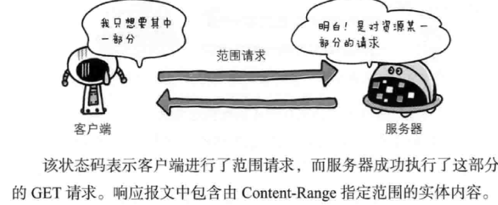
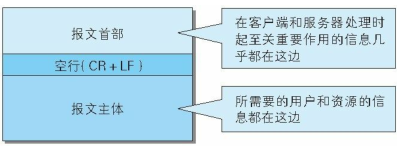
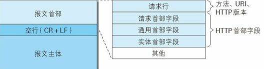
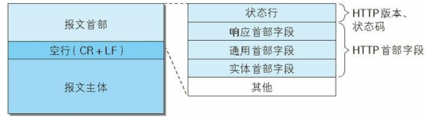

#### 4 返回结果的HTTP状态码([状态码注解](https://www.bookstack.cn/read/http-status-code/6.md))
	状态码的职责是当客户端向服务端发送请求时,描述返回的请求结果.借助状态码,我们能很好的知道,服务端是正常处理了请求还是出现了错误.
状态码的类别
前缀|类别|原因短语
--:|--:|--:|
1XX|informational(信息性状态码)|接收的请求正在处理
2XX|Success(成功状态码)|请求正常处理完毕
3XX|Redirection(重定向状态码)|需要附加操作以完成请求
4XX|Client Error(客户端错误状态码)|服务器无法处理请求
5XX|serve Error(服务端错误状态码)|服务器处理请求出错
##### 4.2  2XX 成功
	2XX的响应结果表明请求被正常处理了.
###### 4.2.1 200 OK
	表示从客户端发来的请求在服务器被正常处理了
###### 4.2.2 204 No Content
	该状态码表示服务器接收的请求已成功处理,但是在返回的响应报文中不包含实体的主体部分.但客户端不需要更新其现有页面。204 响应默认是可以被缓存的。在响应中需要包含头信息 ETag。
###### 4.2.3 206 Partial Content 

		
	HTTP 206 Partial Content 成功状态响应代码表示请求已成功，并且主体包含所请求的数据区间，该数据区间是在请求的 Range 首部指定的。

	如果只包含一个数据区间，那么整个响应的 Content-Type 首部的值为所请求的文件的类型，同时包含 Content-Range 首部。

	如果包含多个数据区间，那么整个响应的 Content-Type 首部的值为 multipart/byteranges ，其中一个片段对应一个数据区间，并提供 Content-Range 和 Content-Type 描述信息。

##### 4.3  3XX 重定向（表明浏览器需要需要执行某些特殊的处理才能完成请求）

##### 4.4  4XX 客户端错误（表明客户端发生错误的原因所在）

###### 4.4.1 400 Bad Request 
	表明服务器无法理解该请求。 客户端不应该在未经修改的情况下重复此请求。
###### 4.4.2 401 Unauthorized
	代表客户端错误，指的是由于缺乏目标资源要求的身份验证凭证，发送的请求未得到满足。
###### 4.4.3 403 Forbidden
	代表客户端错误，指的是服务器端有能力处理该请求，但是拒绝授权访问。
###### 4.4.4 404 Not Found 
	代表客户端错误，指的是服务器端无法找到所请求的资源。返回该响应的链接通常称为坏链（broken link）或死链（dead link），它们会导向链接出错处理(link rot)页面。
###### 4.4.5 405 Method Not Allowed
	表明服务器禁止了使用当前 HTTP 方法的请求。需要注意的是，GET 与 HEAD 两个方法不得被禁止，当然也不得返回状态码 405。
##### 4.5 5XX 服务器错误（表明服务器本身发生错误）
###### 4.5.1 500  Internal Server Error 
	是表示服务器端错误的响应状态码，意味着所请求的服务器遇到意外的情况并阻止其执行请求。
###### 4.5.1 501   Not Implemented
	服务器错误响应码表示请求的方法不被服务器支持，因此无法被处理。服务器必须支持的方法（即不会返回这个状态码的方法）只有 GET 和 HEAD。

	请注意，你无法修复 501 错误，需要被访问的 web 服务器去修复该问题。
###### 4.5.1 502  Bad Gateway
	是一种HTTP协议的服务器端错误状态代码，它表示作为网关或代理角色的服务器，从上游服务器（如tomcat、php-fpm）中接收到的响应是无效的。

	Gateway) （网关）在计算机网络体系中可以指代不同的设备，502 错误通常不是客户端能够修复的，而是需要由途径的Web服务器或者代理服务器对其进行修复。
###### 4.5.1 503  Service Unavailable
	是一种HTTP协议的服务器端错误状态代码，它表示服务器尚未处于可以接受请求的状态。

	Gateway) （网关）在计算机网络体系中可以指代不同的设备，502 错误通常不是客户端能够修复的，而是需要由途径的Web服务器或者代理服务器对其进行修复。

#### 6.1、HTTP报文首部
##### 6.1.1 HTTP请求报文

	上图是HTTP报文的结构
		HTTP协议的请求和响应报文中必定包含HTTP首部。首部内容为客户端和服务端分别处理请求和响应提供所需的信息，对于客户端用户来说，这些信息中的大部分内容都无需亲自查看。
		

    
    HTTP请求报文由方法，url,http版本、http首部字段等构成。
##### 6.1.2 HTTP响应报文
        

    
    HTTP响应报文：在响应总，HTTP报文由HTTP版本、状态码（数字和原因短语）、HTTP首部字段3部分构成。
####6.2　HTTP 首部字段

##### 6.2.1　HTTP 首部字段传递重要信息
	HTTP首部字段是构成HTTP报文的重要因素之一。在客户端和服务端以http协议通信过程中，无论是请求还是响应，都会使用到http首部字段，它能起到传递额外重要信息的作用
	使用首部字段是为了给浏览器和服务器提供报文主体大小，语言，认证信息等内容。
##### 6.2.2　HTTP 首部字段结构

	http首部字段结构是由首部字段名和首部字段值构成。中间用冒号“：”符号分割。
	例子：首部字段名：首部字段值
	Content-type: text/html
##### 6.2.3　4种HTTP 首部字段类型

### 7、确保web安全（HTTPS）
#### 7.1、HTTP的缺点
	http的不足：（未加密的协议也会存在这类问题）
		1、通信使用明文（不加密），内容有可能会被监听
		2、不验证通信方的身份，因此有可能遭遇伪装
		3、无法证明报文的完整性，所有有可能被篡改
##### 7.1.1、通信使用明文可能被监听
	由于http是不具备加密的功能，所有也无法做到对通信整体（使用http协议通信的请求或响应的内容）进行加密。即，http报文使用明文（未被加密的报文）方式发送。
	
	TCP/IP是可能被窃听的网络
	如果要问为什么通信不加密是一个缺点，这是因为，按TCP/IP协议族的工作机制，通信内容在所有的通信线路上都有可能遭到窥视。
##### 7.1.2、不验证通信方的身份，因此有可能遭遇伪装
		http协议中的请求和响应不会对通信方进行确认，也就是说存在‘服务器是否就是发送请求中URL真正指定的主机，返回的响应是否真的返回实际提出请求的客户端’等类似问题。
		任何人都可以发起请求（但也仅限于发送端的 IP 地址和端口号没有被 Web 服务器设定限制访问的前提下）
		http协议的实现非常简单，会存在以下各种隐患
			不能确定返回响应的服务器是否真的服务器（有可能是伪装的web服务器）
			不能确定请求的客户端是否
		
##### 7.1.2、无法证明报文的完整性，所有有可能被篡改
	
