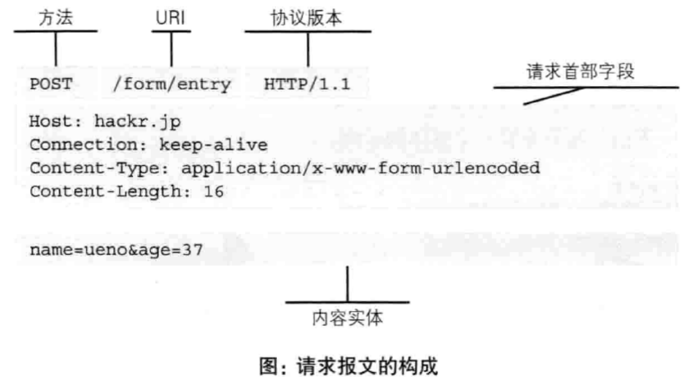
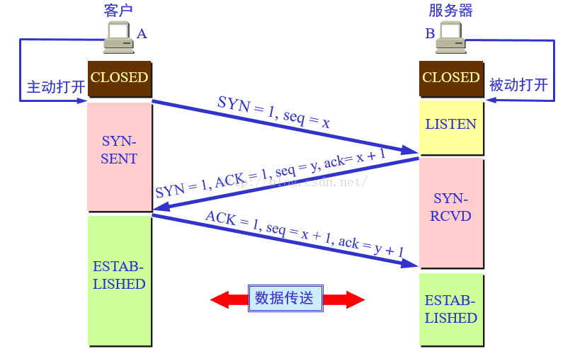
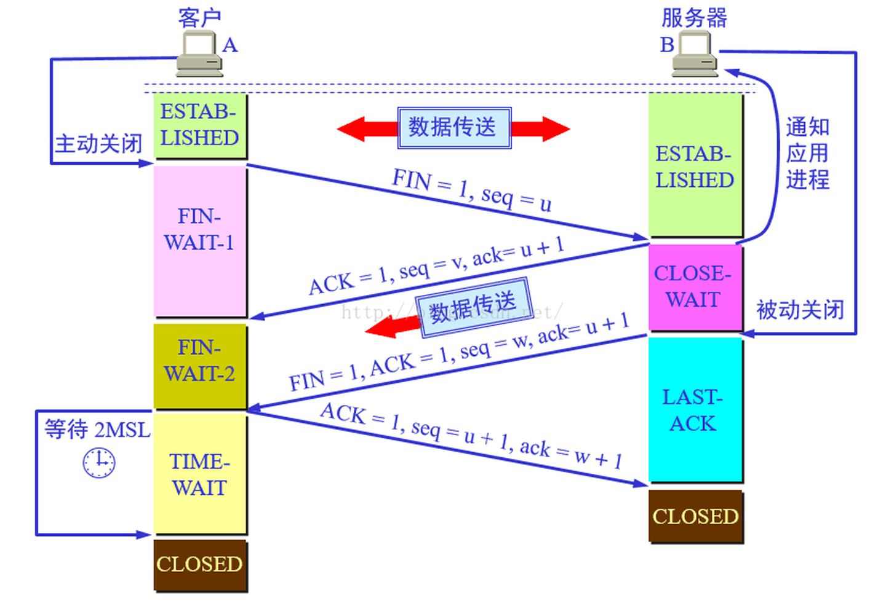

### 1、什么是http

- HTTP是一个基于TCP/IP协议集的子集，用来传输文本、图片、视频、或者是请求的应用层协议（超文本传输协议）

### 2、http特点

* HTTP是简单的
* HTTP是可扩展的
* 无状态

### 3、http报文的组成部分

    一个http 主要是由请求报文和响应报文组成，一般由客户端（比如浏览器）向服务端发起，服务端处理后，响应返回信息客户端。

* 请求报文（请求报文一般由五部分组成）
    * **请求方法**（常用**get**,**post**）
    * 请求**url**（是一种统一资源标识符）
        * URI是统一资源标识符，URL是统一资源定位符，URL是URI的子集
        * 组成：协议://域名：端口号/<路径>（http://www.baidu.com:80/home）
    * **协议版本号**：HTTP主版本号：次版本号（前面三，可以组合统称为**请求行**）
    * **请求头**（Request header）
    * **请求体**（Request Body）
        * 在HTTP1.0中。请求体包括实体头域，实体主体。
            * 实体头域字段包括以下：
            | Content-Encoding
            | Content-Language
            | Content-Length
            | Content-Location
            | Content-MD5 
            | Content-Range
            | Content-Type
            | Expires
            | Last-Modified
            | extension-header
            * 实体主体：可以理解为请求参数（主体的数据类型由实体头域的 Content-Type 和Content-Encoding 头域确定）
        * 在HTTP1.1中规范不再引用实体，实体标头或实体主体。统一称之为请求头（[参考MDN](https://developer.mozilla.org/en-us/docs/Glossary/Entity_header)）。以上内容参考 **超文本传输​​协议-HTTP / 1.1** 这本书。

    * **总结**：请求报文是由请求方法(GET,POST),请求url(统一资源标识符),协议版本(http/1.1),可选的请求首部字段和内容实体构成的
    
* **响应报文**
    * 响应头部
    * 响应**状态码（Status Code）**
        * 1xx 报告的 -请求被接收到，继续处理
            * 100 客户端应该继续请求，100响应是个中间响应
        * 2xx 成功 - 
            * 200 响应成功，并返回
            * 204
            * 206 服务端已经完成部分的请求，请求必须包含一个range头域
        * 3xx 重发（重定向） - 为了完成请求必须采取进一步的动作
            * 301 永久移动 -请求的网页已经永久移动到新的位置，服务端响应时，会自动将请求者转到新的位置
            * 302 临时移动 - 请求的资源临时存放在不同的url下，但请求者应继续使用原来位置来进行以后的请求。
            * 304 没有改变（未修改） - 客户端再次请求资源，并且资源未做改变，那么服务器应该以此状态码来响应。
            * 307 临时重定向 - 服务器目前从不同的位置响应请求，但请求者应继续使用原有位置来进行以后的请求。
        * 4xx 客户端出错 请求包括错的语法或不能被满足
            * 400 请求错误 -服务端不能理解的请求，客户端不应该在没有做修改的前提重复发起请求
            * 401 未授权 - 请求要求身份验证。对于需要登陆的网页，服务器可能返回此响应
            * 403 禁止 - 服务端拒绝请求
            * 404 未找到 - 服务端找不到请求的地址
            * 405 请求方法不被允许 - 此状态码表明请求头里的方法对此资源来说不被允许。响应必须包含一个allow头域,此头域包含一系列对此请求资源有效的方法。
        * 5xx 服务器出错 服务器无法完成显然有效的请求
            * 500 服务器内部出错 - 服务器遇到错误，无法完成请求
            * 502 错误网关 - 做为网关或者代理服务器，从上游服务器接收了一个无效的响应
            * 503 服务不可用
            * 504 网关超时
            * 505 HTTP版本不受支持 - 服务器不支持请求中所用的HTTP协议版本。
    * 响应实体
        响应的内容（返回值）

### HTTP连接
```
    一次HTTP请求可分为 DNS查询、连接（tcp连接）、请求、事务处理、响应、关闭连接。每一步都会产生时延。其中，相对于连接、请求所消耗的时间，事务处理的时间是很短的。

    在HTTP1.0时，每一个资源的请求都需要建立一个独立的HTTP连接，这加重了HTTP服务器的负担，容易引起网络的阻塞。

    HTTP1.0+keep alive连接，被当作是试验型的持久化连接。

    Connection：Keep-alive
    Keep-Alive: max=5,timeout=120

    在HTTP1.1不需要这个属性，默认开启持久化连接

    持久化连接的优点：
        1、重用TCP连接，以消除连接和关闭的延时。
        2、重用连接：HTTP1.1允许客户端执行多次请求，而不用等待每一个请求的响应，并且此时只有一个tcp连接被使用。
    并行连接的优点
        1、通过多条TCP连接发起并发的HTTP请求
```

* TCP连接

```
    TCP使用三次握手的方式来尝试建立连接。在连接之前，客户端和服务端都是处于CLOSED关闭状态。
```
握手期间用的名词：

|  缩写 | 意思  |
|  ----  | ---- |
|  SYN  | 同步序列号。仅从两端发送的第一个数据包应设置此标志。  |
|  ACK  | 表示确认字段有效。客户端发送的初始SYN数据包之后的所有数据包都应设置此标志  |
|  seq  | 序列号  |

* 第一次握手：
    * 客户端通过向服务端发送SYN(**同步序列号**)主动打开连接。并且客户端将段的seq(**序列号**)设置为随机数x。
* 第二次握手
    * 服务端接收到客户端发送数据包中包含SYN为1的值（建立请求），服务端将标志值SYN和ACK都设置为1。并将确认号（ack）设置为接收到的序列号的值加1（ack=x+1），并且随机生成序列号的值为y(seq=y)
* 第三次握手
    * 客户端检查ACK是否为1，ack是否为x+1.如果正确，则将ACK置为1，ack=y+1（同理确认号，为接收到的序列号+1）。序列号则为接收到的确认号的值（seq=x+1。 seq=确认号ack（上一个确认号为ack））

    至此，TCP就建立了连接。客户端和服务端就可以进行通信了。


|  连接状态   | 介绍  |
|  ----  | ----  |
| CLOSED  | 服务端和客户端完全没有连接 |
| LISTEN | 等待来自任何远程TCP端点的连接请求。
| SYN-SENT  | 发送连接请求后，等待匹配的连接请求。 |
|SYN-RECEIVED| 接收并发送连接请求后，等待确认连接请求确认。
|ESTABLISHED| 已建立连接，可以将接收到的数据传递给用户。连接的数据传输阶段的正常状态。

* 四次挥手

|  缩写 | 意思  |
|  ----  | ---- |
|  FIN  | 来自发送方的最后一个数据包  |
|  ACK  | 表示确认字段有效。客户端发送的初始SYN数据包之后的所有数据包都应设置此标志  |
|  seq  | 序列号  |


* 第一次挥手：
    * 数据传输结束之后，客户端发起连接中断请求，也就是发送FIN为1和seq为u的数据包

* 第二次挥手：
    * 服务端接收到结束请求的数据包，服务端发出确定报文，ACK=1，seq=v，ack=u+1.这个时候，服务端处于半关闭状态（客户端不会再向服务端发送请求，但是服务端仍会继续发送响应数据）
* 第三次挥手：
    * 当服务端响应完毕后，其应用进程通知服务器关闭tcp连接。这个阶段，服务端发送最后一个报文。报文包括FIN=1,ACK=1,ack=u+1,seq=w

* 第四次挥手：
    * 客户端收到关闭连接报文端之后，发送ACK=1，seq=u+1,ack=w+1。再经过2MSL(最长报文端寿命)后，本次TCP连接真正结束



|  连接状态   | 介绍  |
|  ----  | ----  |
| FIN-WAIT-1  | 等待来自远程TCP的连接终止请求，或者等待先前发送的连接终止请求的确认。 |
| CLOSE-WAIT  | 等待本地用户的连接终止请求 |
| FIN-WAIT-2 | 等待来自远程TCP的连接终止请求。
|LAST-ACK| 等待先前发送给远程TCP的连接终止请求的确认（包括对其连接终止请求的确认）
|TIME-WAIT|等待足够的时间以确保远程TCP收到其连接终止请求的确认
[参考](https://en.wikipedia.org/wiki/Transmission_Control_Protocol)

[图列](https://zhuanlan.zhihu.com/p/24860403)

[http连接性能优化](https://alittlelittlestar.github.io/2018/10/14/HTTP/http%E8%BF%9E%E6%8E%A5%E6%80%A7%E8%83%BD%E4%BC%98%E5%8C%96/)

[keep-alive](http://51write.github.io/2014/04/09/keepalive/)

* tcp连接为什么不是两次或者四次。

    因为TCP:是一种面向连接的（在收发数据之前，必须和对方建立可靠的连接）、可靠的、基于字节流的传输层通信协议。

    实现可靠传输，发送方和接收方始终需要同步( SYNchronize )序号

    * 为什么不是四次
        * 首先我理解的。可以使用四次，就如四次挥手的时候，将三次握手中的第二次握手中分成两步，第一步是发送确定报文，然后在发送同步序列号。
        * 但是为什么不用呢？
        * 因为tcp的每次握手都有一定的开销，所以，将上述说的合并成一步。可以提高tcp连接的效率和速度。

    * 为什么不是两次
        * 如果是两次，两次的过程就是这样
        * 第一次握手：客户端发送SYN=1,seq=x
        * 第二次握手：服务端发送SYN=1,ACK=1,ack=x+1,seq=y

        这里有个问题：那就是我们无法确定客户端是否接收到服务端返回的同步序列号。如果这个同步信号丢了，客户端无法与服务端的初始序列号达成一致。这样就不能保证tcp的可靠传输的作用

### 缓存


### 安全

### http1.0和http2.0以及https的区别


