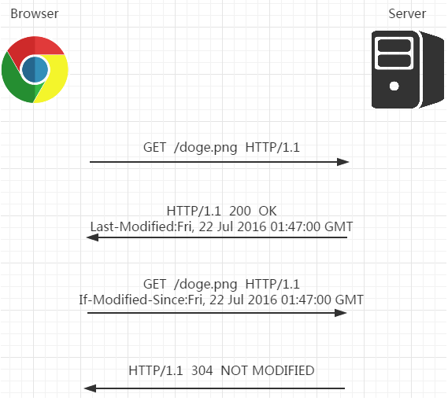
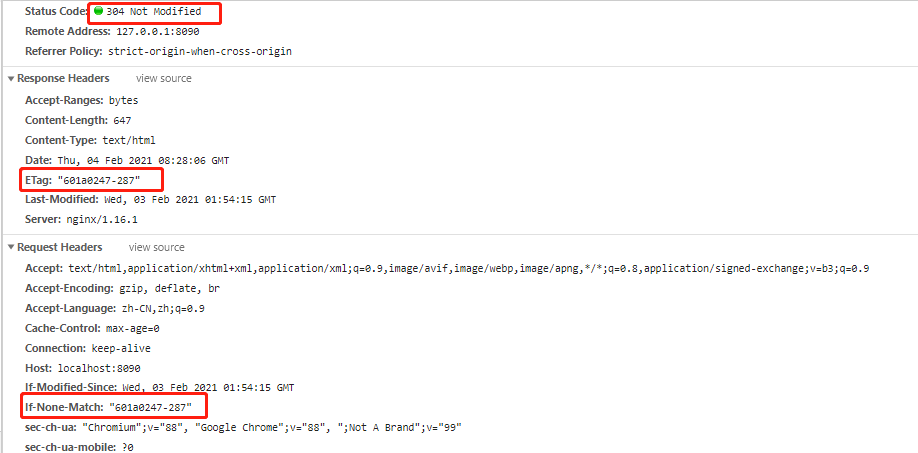
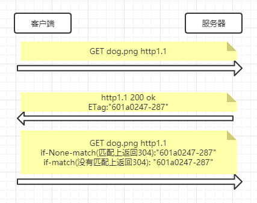
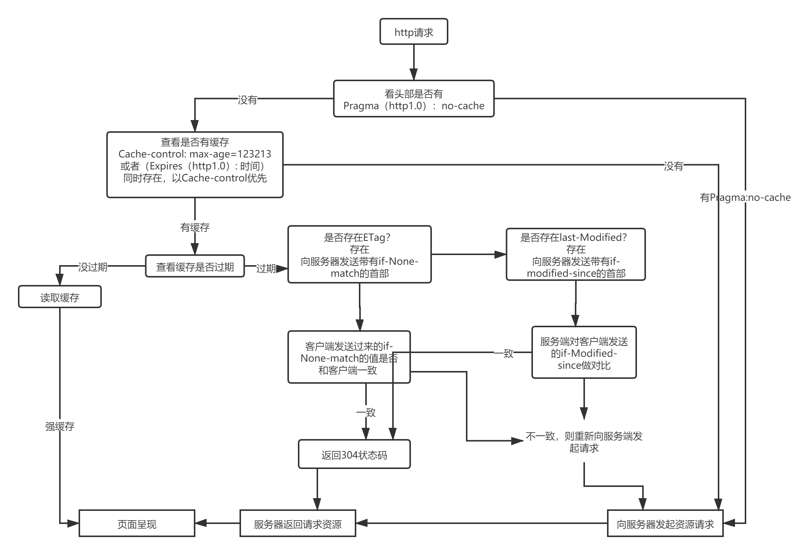

### 引言
    通过网络获取资源的成本高和时间长；因此合理的使用缓存，能降低获取资源的成本和时间，这也便成为性能优化的一个很关键的方面（缓存对第一次获取无效）。

### 与缓存相关的httP首部字段。

1. **通用首部**

|  字段名称 | 说明  |
|  ----  | ---- |
|  Cache-Control    |  控制缓存的行为 |
|  Pragma  | **http1.0**的产物，由于其未指定用于http响应，所以不能替代http1.1中Cache-Control。通常用作http1.0客户端的向后兼容。Pragma: no-cache;表示无缓存  |
|    |  |

2. **请求首部字段**

|  字段名称 | 说明  |
|  ----  | ---- |
| if-Match | 比较ETag是否一致
| if-None-Match| 比较ETage是否一致
| if-Modified-Since| 比较资源最后更新的时间是否一致
| if-Unmodified-Since| 比较资源最后更新的时间是否不一致
|    |  |

3. **响应首部字段**

|  字段名称 | 说明  |
|  ----  | ---- |
| ETag|资源的特定版本的标识符
|    |  |

4. **实体头部字段**

|  字段名称 | 说明  |
|  ----  | ---- |
| Expires| 过期时间。http1.0的产物。在Cache-Control响应中包含带有'max-age'或者's-max-age'指令的时候,Expries会被忽略
|  Last-Modified  | 资源最后一次更新时间 |
|    |  |

#### **HTTP1.0的缓存方式**

    在HTTP1.0时期，给客户端设置缓存的方式通过两个字段Expires、pragma来实现。虽然这两个字段早可抛弃，但是为了做向下兼容，还是能在很多网站上看到这两个字段。

#### **[1、Pragma](https://cloud.tencent.com/developer/section/1189975)**
```
    Pragma: no-cache(告知客户端不要对读取该资源缓存，每次都从服务器请求资源)

    如果同时存在pragma和Cache-control

    Cache-control: public,max-age=84600（设置缓存时间为一天）
    Pragma: no-cache（设置没有缓存）

    页面重新发起请求的时候，会发现，实际上资源会重新发一次请求。
    这个能说明Pragma的优先级大于Cache-control

    
```
#### **[2、Expires 设置缓存日期](https://cloud.tencent.com/developer/section/1189940)**

> 语法

> Expires: \<http-data\>服务器的时间

> 示例

> Expires: wed, 21 Oct 2020 07:28:00 GMT

> Expires: 0 ；代表资源已过期
```
如果同时存在Expires和Cache-control;

Expires: wed, 21 Oct 2021 07:28:00 GMT
Cache-Control: max-age=61256155

则Expires会被忽略
```

综上所述:我们可以知道Pragma > Cache-Control > Expires

#### **[3、Cache-Control（通用头字段）【HTTP1.1新增的缓存机制指令】](https://cloud.tencent.com/developer/section/1189911)**

> 作为请求首部

> Cache-Control: max-age=\<second(秒)> 设置缓存时间单位秒 \
> Cache-Control: no-cache 不使用缓存，要求向原服务器重新请求 \
> Cache-Control: no-store 告知服务器内容不会被保存 \

> Cache-Control: max-stale=\<second(秒)>\
> Cache-Control: max-fresh=\<second(秒)>\
> Cache-control: no-transform \
> Cache-control: only-if-cached

> 作为响应首部

> Cache-control: public 表明任何时候都需要缓存该资源\
> Cache-control: private 表明响应只能被单个用户缓存，不能作为共享缓存（即代理服务器不能缓存它）。私有缓存可以缓存响应内容，比如：对应用户的本地浏览器。 \
> Cache-Control: max-age=\<seconds> 告知服务器在时间内是新鲜的，不需要向服务器重新发起\
> Cache-control: no-cache 不直接使用缓存，要求向服务器重新发起\
> Cache-control: no-store 所有内容都不会被保存\
> Cache-control: must-revalidate\
> Cache-control: no-transform\
> Cache-control: proxy-revalidate
> Cache-control: s-maxage=\<seconds>\


#### **缓存校验字段**

```
上述的首部字段是决定了是否向服务端发送请求，比如设置的缓存时间没过期，那么直接从本地缓存中取对应资源（在chrome中体现为memory cache或者disk cache），若缓存时间过期或资源不走缓存（强制刷新或者Ctrl+F5刷新），则会重新发送请求


为了让客户端与服务器之间能实现缓存文件是否更新的验证、提升缓存的复用率，Http1.1新增了几个首部字段来做这件事情。
```
##### **1. Last-Modified**

    服务器将资源传递给客户端后，会将资源最后的修改时间以Last-Modified:GMT的形式加在首部一起返回给客户端
> 语法

> Last-Modified: \<day-name>, \<day> \<month> \<year> \<hour>:\<minute>:\<second> GMT

> 例子

> Last-Modified: Wed, 21 Oct 2015 07:28:00 GMT 

```
客户端会为资源标记上该信息，下次再请求的时候，会把该信息附带再请求报文中一并给服务器做检查。
1、若传递的时间值与服务器上该资源最终修改时间一致，则说明该资源没有被修改过，直接返回304状态码,并且内容为空，这样就节省了传输数据量。
2、若不一致，则返回200状态码，和第一次请求资源类似。

```


> 1、if-Modified-since: last-modified-value

> 示例：if-Modified-since: Thu, 31 Mar 2016 07:07:52 GMT

> 请求首部告诉服务端，如果客户端传来的最后修改时间与服务端一致，直接返回304即可。（当前浏览器都是使用这个请求首部来向服务端传递保存的last-modified的值）

> 2、if-Unmodified-since: last-modified-value

> 告知服务端，如果客户端传来的最后修改时间和服务端不一致，则返回412（412 Precondition Failed（先决条件失败）表示客户端错误）的状态码给客户端。

问题：last-Modified存在一定问题。当服务端内的资源被修改了，但是内容确没有发生变化，会因为last-Modified没有匹配上从而重新去发起请求。
##### **2. ETag**
```
    http1.1为了解决last-Modified可能存在不准确的问题,推出了ETag实体首部。

    作用和last-modified是一样的。这里直接看图就好了。
```



最后总结看以下这张图：


