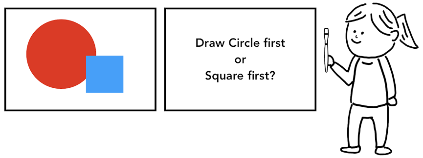
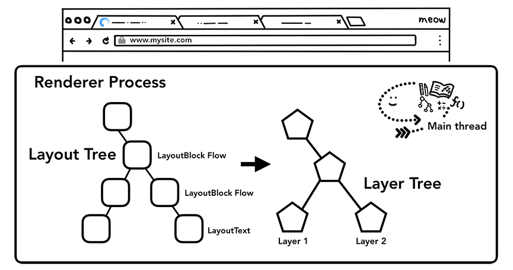

[参考google官方文档](https://developers.google.com/web/updates/2018/09/inside-browser-part2)

[这篇文章是对上篇文章的一个解释](https://juejin.im/post/6844903782128566286)

首先要了解浏览器的进程和线程的关系：[参考进程和线程](./ThreadsAndProcesses.md)

浏览器进程具有以下线程：UI线程（用于绘制浏览器的按钮和输入字段）、网络线程（处理网络堆栈以从Internet接收数据）、存储线程（用于控制文件的访问）等等。在地址栏输入内容时，输入由ui线程处理。

输入内容：

1、用户在浏览器地址栏输入内容时，**ui线程**会需要对输入内容进行**解析**，并决定是将输入的内容发送到搜索引擎还是请求的网站。

2、当按下Enter键时：UI线程会发起网络调用以获取网站内容。这个时候，浏览器导航栏显示loading状态（页面还是处于前一个，因为新页面的数据还没有响应）。

3、网络线程，获取到url，先去本地缓存中查找是否有缓存文件，如果有，拦截请求。直接200返回，否则进入网络请求过程。

4、网络请求之前会进行DNS解析，以获取请求域名的服务器ip地址。如果请求协议是https,还需要建立TLS连接

5、网络进程解析响应流程；

    5.1 检查状态码，
        如果是301/302，则需要重定向，从 Location自动中读取地址，重新进行第4步
        （301/302跳转也会读取本地缓存吗？这里有个疑问），如果是200，则继续处理请求。
    5.2 200响应处理：
        检查响应类型Content-Type，如果是字节流类型，则将该请求提交给下载管理器，该导航流程结束，不再进行
6、查找渲染器进程
    
    Network线程确信浏览器应导航到请求的站点，则Network线程将告知UI线程数据已准备就绪。然后，UI线程找到一个渲染器进程来进行网页渲染。

7、提交导航

    就是将已接收到的数据和和准备好的渲染器进程，将IPC（进程间通信）从浏览器进程发送到渲染进程的过程，它还会传递数据流，因此渲染器进程可以继续接收HTML数据。

    文档加载阶段开始。

    1、地址栏已更新，安全指示符和网站设置UI反映了新页面的网站信息

    2、该选项卡的会话历史记录将被更新，因此后退/前进按钮将逐步浏览刚刚导航到的站点


在用户输入关键字并键入回车之后，在替换新页面之前，会执行当前页面的beforeunload事件（如果存在的话,存在一定的兼容性）
```
window.addEventListener('beforeunload', (event) => {
    console.log(11111)
    // event.preventDefault();
});
```

在进入加载状态时，页面并没有立即跳转到新的页面，而是停留在原页面上

### 渲染进程

渲染进程的核心工作是将HTML、CSS和Javascript转化为用户可以与之交互的网页

1）解析中：

1、DOM的构建
```
    为什么需要构建DOM树呢？因为浏览器无法直接使用HTML，所有需要将html转化为浏览器能够理解的结构---DOM树

    DOM是浏览器对页面的内部表示以及Web开发人员可以通过JavaScript与之交互的数据结构和API。
```


2、子资源加载
```
    解析构建DOM时：如果遇到图片、css、js等外部资源时，需要从网络或缓存中加载，主线程会按照顺序逐个加载，为了加快速度，“预加载扫描器（preload scanner）”会同时进行。如果文档有<link>,预加载扫描器会在浏览器进程中发送请求。
```
3、js阻塞解析：解析构建DOM时，遇到script时，会暂停解析先加载js并执行js内部的代码


2）：样式计算

    只有DOM元素无法确定页面的外观。需要结合css样式。主线程解析css并确定每个DOM节点计算后的样式（浏览器具有默认样式和继承）

主线程解析CSS以添加计算样式

3）：布局（flow 布局是查找元素几何形状的过程）reflow

渲染进程知道每个节点的文档结构和样式，但是还是不足以渲染页面。

```
主线程遍历DOM和计算样式，并创建布局树，其中包括诸如xy坐标和边框大小之类的信息。布局树的结构可能是DOM树的机构类似，但它仅包含页面可见内容的信息。如果存在display:none;则该元素不属于布局树（visibility:hidden在布局树当中）。如果存在伪类，即使不存在DOM中，它也存在于布局树当中。

确定页面的布局是一项艰巨的任务。即使是最简单的页面布局（如从上到下的块流程）也必须考虑字体的大小以及在何处换行
```


4）绘制（paint）

拥有dom、样式和布局，仍然不足以呈现画面（比如要画一幅画，你知道你要画的大小，形状和位置。但是还需要画内容和颜色等等之类的）。

一个拿着画笔的画布前面的人，想知道他们应该先画圆形还是正方形

在绘制过程中，主线程遍历布局树（layout tree）以创建绘制记录(paint records)。绘画记录是绘画过程的注释，例如“先是背景，然后是文本，然后是矩形”。

主线程遍历布局树并生成绘制记录

* 更新渲染管道的成本很高

DOM + Style，Layout和Paint树的生成顺序

从上面我们可以知道。为什么说回流（重新布局）和重绘（重新绘制）
也就是说为什么回流会引起重绘。而重绘不一定会引起回流的原因。

### 合成

合成是一种将页面的各个部分分成若干层，分别对其进行栅格化并在称为合成器线程的单独线程中作为页面进行合成的技术。

主线程遍历了布局树以创建图层树（该部分在DevTools性能面板中称为“更新图层树”）

主线程遍历布局树生成层树

* 主线程的光栅化和合成

一旦创建了图层树和确定了绘制顺序，主线程将会把信息传递给合成线程，接着，合成线程会光栅化每个图层，一个图层可能跟页面一样大，合成线程将其分块后发送给光栅线程。光栅线程光栅化每个小块后将他们存储在显存中。

光栅线程创建分块的位图并发送到 GPU

合成线程会不同的光栅化线程设置优先级，以便视图或者附近区域的画面可以先光栅化显示。图层还具有不同的分辨率的块，可以放大显示。

一旦块被光栅化，合成线程会收集这些块的信息（称为绘制四边形），创建合成帧。
* 绘制四边形：包含块在内存的位置，以及合成时块在页面中的位置等信息。
* 合成帧：一个绘制四边形的集合，代表一个页面的一帧。

接着，合成帧通过IPC提交给浏览器进程，此时，可以在UI线程或者其他插件的渲染进程添加一个合成帧，这些合成器帧被送到GPU然后在屏幕上显示。如果收到滚动事件，合成帧会创建另一个合成帧到GPU。

**合成线程创建合成帧，将其发送到浏览器进程，再接着发送到 GPU**


// 最后的合成和光栅化 有啥作用