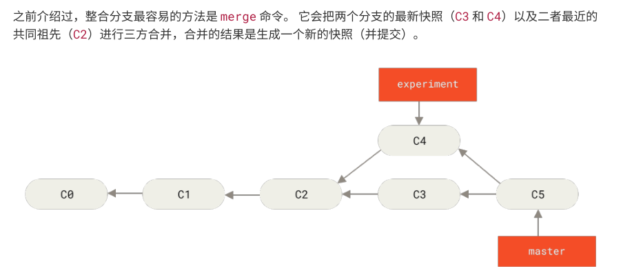
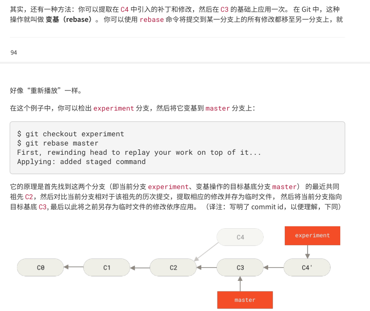

https://mp.weixin.qq.com/s/2_ad5DRsrD_LVqmp-EmMmw

https://www.bookstack.cn/read/git-tutorial/docs-commands-git-stash.md

#### 打标签

创建标签：标签分为两种:轻量标签（lightweight）与附注标签（annotated）

轻量标签：像一个不会改变的分支--它只是某个特定提交的引用

附注标签：是存储再git数据库中的完整的一个对象，他们可以被校验的，其中包含打标签者的名字、电子邮箱、日期，此外还有一个标签信息。

###### 附注标签：

创建：git tag -a v1.4 -m 'test' 
//解释：git tag -a 创建一个附注标签
v1.4标签名称 
-m 选项指定了一条将会存储在标签中的信息
'test': 提交的信息

###### 轻量标签
创建：git tag v1.4-li

给过去提交的打标签

```
输入log 查看提交日志
git log --pretty=oneline

617a5de18096b52386f25b218d06276b183a2e37 (HEAD -> master, tag: v1.4, tag: show, origin/master, origin/HEAD) 修改
d6e07b933152fafc5c557265c4619b81d5a4d711 Merge branch 'master' of github.com:benfangdesaozhu/study
baa98cc9ee45a0b4608b369fab79b46d8eb9bca7 数据结构h和s算法
3bd8a5f0ba66af73d6059c645c89c28293f21036 webpack
36ef2e96aafcc9049b5e654a7fe78d8bf3662c64 总结
22bd3f968dc0eef455116085f97ae6d72d909b45 xiugai
8e4560547d09b8c4b3e1262a9541006a7ffb0d46 '修改'
4eb0f67a3faa2c1779800452a112530c7e66efa0 前端安全
ae96622c6ec313c76d528f641f8bc5173a775305 添加来源
```
假如。我们给webpack加上对应标签

git tag -a v1.5 3bd8a5f0ba（末尾指定提交的校验和（或部分校验和））

这样就再webpack部分打上对应tag

###### 共享标签（同步到远程）

上述的命令都是再本地上创建对应的tag.创建完标签后你必须显式地推送标签到共享服务器上
这个过程就像共享远程分支一样——你可以运行 ***git push origin <tagname>###***

###### 删掉标签(git tag -d <tagname>)

删除本地的tag: git tag -d show
删除远程的tag：git push origin --delete <tagname>


### git分支

#### 分支创建

命令：git branch <branchname>

#### 分支切换
命令：**git checkout <branchname>**

#### 分支的创建并切换过去

命令：**git checkout -b <newbranchname>**

#### 分支的合并
命令： **git merge <branchname>**
#### 删除分支
命令： **git branch -d <branchname>**(删除本地)
命令： **git push -d <branchname>**(删除本地)

#### 建立当前分支与远程分支的映射关系:
git branch --set-upstream-to=origin feature/1.8.1 feature/1.8.1

### 分支管理

#### 查看分支
命令： **git branch**
命令： **git branch -a** （查看所有分支）

#### 推送
命令：**git push**

rebase和merge的区别



  
> git checkout -b my-test  //在当前分支下创建my-test的本地分支分支
  
> git push origin my-test  //将my-test分支推送到远程
  
> git branch --set-upstream-to=origin/my-test //将本地分支my-test关联到远程分支my-test上   
  
> git branch -a //查看远程分支
  
  git reset --soft HEAD^   撤销commit (回退你已提交的 commit，并将 commit 的修改内容放回到暂存区。)

#### 删除分支s
#### 删除分支
  git branch -d branchName(删除本地分支)
  
  yarn dev -p 3001 更换端口

#### git stash
  git stash 命令将用于暂时保存没有提交的工作。运行该命令后，所有没有commit的代码，都会暂时从工作区移除，回到上一次commit的状态

  # 暂时保存没有提交的工作
  git stash 或者 git stash save 'message' 可以备注信息

  # 列出所有暂时保存的工作
  git stash list

  # 恢复最近一次stash的文件
  git stash pop

  # 删除所有的stash
  git stash clear

#### git cherry-pick
  给定一个或多个现有提交，应用每个提交引入的更改，为每个提交记录一个新的提交。这需要您的工作树清洁（没有从头提交的修改）。

  将已经提交的 commit，复制出新的 commit 应用到分支里

  git cherry-pick commit1 commit2