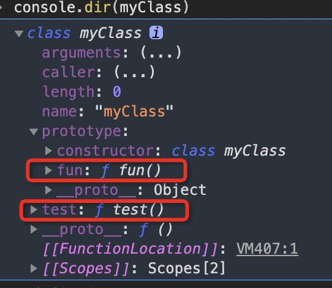

### class 类

再介绍类之前。我们先回顾下构造函数
```
function Car (name, price) {
    this.name = name
    this.price = price
}
Car.prototype.run = function() {
    console.log('run')
}
var mzd = new Car('马自达','14')
mzd.constructor === Car //  true
mzd.run() // run
```
es6引进类，作为对象的模版。通过class关键字，可以定义类

事实上，es6的类可以看作是一个语法糖。它的绝大部分功能都能通过es5实现。新的class写法只是让对象原型的写法更加清晰、更像面向对象编程的语法而已。

```
上面的代码可以使用es6的类来写

class Car{
    constructor(name, price) {
        this.name = name 
        this.price = price
    }
    run(){
        console.log('run')
    }
}
var mzd = new Car('马自达','14')

mzd.constructor === Car //  true
mzd.run() // run
```

```
constructor方法

constructor方法是类的默认方法。通过new命令生成的对象实例的时候，自动调用该方法。一个类必须拥有constructor方法，如果没有定义，会默认添加一个空的constructor方法。

默认返回实例对象(即this).也可以指向返回另一个对象。
```

```
类的实例对象

function Point(x,y){
    this.x = x;
    this.y = y;
    console.log(x + y)
}
es5之前。构造函数不单单可以直接调用，也可以使用new Point(1,2)


class PointC {
  constructor(x, y) {
    this.x = x;
    this.y = y;
  }
  toString() {
    return '(' + this.x + ', ' + this.y + ')';
  }
}
而类的调用。只能使用new PointC(1,2). 
不能直接使用PointC(1,2)
```

```
不存在变量提升

Class不存在变量提升（hoist），这一点与ES5完全不同。

es5中:可以正常执行。如下面的实例

new Point(1,2)
function Point(x,y){
    this.x = x;
    this.y = y;
    console.log(x + y)
}

而class中

new PointC(1,2) // 报错：PointC is not defined
class PointC {
  constructor(x, y) {
    this.x = x;
    this.y = y;
  }
  toString() {
    return '(' + this.x + ', ' + this.y + ')';
  }
}
```

#### 私有方法

特点：
1、私有方法本身是可以访问类内部的所有属性(即私有属性和公有属性)
2、私有方法是不可以在类的外部被调用

私有方法是常见需求，但ES6不提供，只能通过变通方法模拟实现。

```
class myClass{

  // 公有方法
  foo(baz) {
    console.log(111)
  }
  // 模拟静态方法
  bar(){
    bar1.call(this, 1,2)
  }

  // 约定某一规则进行定义 比如这里：约定下划线的为静态方法
  _bar() {

  }
};

function bar1 (x,y) {
    console.log(x,y)
}

// 这样实例还是能正常调用模拟的静态方法。所有还是不太行。只能约定
```
#### this 的问题

```
只要我们不在class的constructor方法内改变this指向。
这个类创建的实例，this都指向该实例。

class myClass{
  constructor(x,y) {
      this.x = x 
      this.y = y
  }
  foo(baz) {
    console.log(baz, this.x)
  }
};
var myclass = new myClass(1,2)

var {foo} = myclass

foo() // 使用结构赋值之后，直接调用foo。this指向改变
```

```
Class的取值函数(get)和存值函数(set)
和es5一样。在类的内部可以使用get和set。可以对属性的存取值进行拦截

class myClass{
  get property () {
      console.log('getter: ')
      return '获取属性'
  }
  set property(val) {
      console.log('setter: '+val)
      return val
  }
};
var inst = new MyClass();
inst.property = 123
inst.property
```
#### class类的静态方法
```
类相当于实例的原型，所有定义在类上的方法，都能被实例继承。如果在方法前面加上static关键字，就表示该方法不会被继承。只能直接通过类来调用。这就是类的静态方法
class myClass{
  fun(){}
  static test () {
      console.log(this,111)
  }
};
myClass.test() // class myClass, 111

```


注意，如果静态方法包含this关键字，这个this指的是类，而不是实例。

子类可以继承父类的静态方法

静态方法也是可以从super对象上调用的。


#### 类的静态属性和实例属性

在es6中。类的内部只有静态方法，没有静态属性

```
class myClass{
 
};
myClass.property = 1 // 静态属性定义
上面的写法为myClass类定义了一个静态属性prop。

但是对静态属性已经有新提案
```

#### new.target属性

作用：一般用在构造函数当中，返回new命令作用的那个构造函数。如果构造函数不是通过new调用的，则这个属性返回undefined.如果是new调用的，则返回当前构造函数

```
function Person(name) {
    if(new.target === undefined) {
        throw new Error('必须使用 new 命令生成实例')
    } else {
        console.log('new 生成实例')
    }
}
Person() // 报错
new Person() // new 生成实例
```

Class内部调用new.target返回当前Class
```
class myClass{
    constructor() {
        console.log(new.target === myClass)
    }
};
new myClass() // true
```

需要注意的是，子类继承父类时，new.target会返回子类。
```
class Person{
    constructor() {
        console.log(new.target, new.target===cjm)
    }
};
class cjm extends Person {
    constructor() {
        super()
    }
    say(){

    }
}
new cjm() // class cjm, true

我们可以根据这个，生成一个只能继承的类

class Person{
    constructor() {
        if(new.target === Person) {
            throw new Error('本类不能实例化');
        }
    }
};
class cjm extends Person {
    constructor() {
        super()
    }
    say(){

    }
}
new Person() // 报错：Uncaught Error: 本类不能实例化
new cjm() 
```

注意，在函数外部，使用new.target会报错。


#### 类的继承

类通过extends关键字来实现继承。如上面的例子。
```
class Point{

}

class ColorPoint extends Point {
  constructor(x, y, color) {
    super(x, y); // 调用父类的constructor(x, y)
    this.color = color; // 只有子类调用了super方法，才能使用this。否则报错
  }

  toString() {
    return this.color + ' ' + super.toString(); // 调用父类的toString()
  }
}
子类的constructor方法必须调用super()方法。否则新建实例时会报错

这是因为子类自己的this对象，必须先通过父类的构造函数完成塑造，得到与父类同样的实例属性和方法，然后再对其进行加工，加上子类自己的实例属性和方法。如果不调用super方法，子类就得不到this对象。
```
Object.getPrototypeOf方法可以用来从子类上获取父类。
Object.getPrototypeOf(ColorPoint) === Point

因此，可以使用这个方法判断，一个类是否继承了另一个类。

#### super关键字

supe关键字既可以当作方法也可以当作对象。

当作方法时：super只能使用在子类的constructor方法中，不能出现在其他地方。并且，必须在子类的constructor方法调用super().否则会报错。（如果不定义constructor,会默认创建一个constructor并调用super）

当作对象时：在普通方法中，指向父类的原型对象；在静态方法中，指向父类。

ES6 规定，在子类普通方法中通过super调用父类的方法时，方法内部的this指向当前的子类实例。(super.fun)