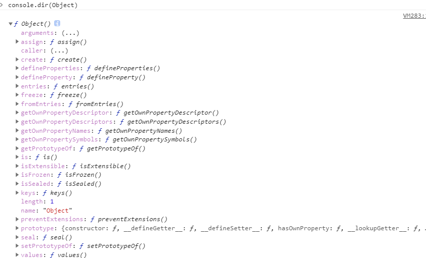

##### 属性的简洁表达式

```
var x = 1
var a = {x} // 这里的x即使属性的名，也是属性的值

相当于

var x = 1
var a = {x: 1}
```

```
var a = {
    x,
    test:function() {

    }
}
相当于
var a = {
    x,
    test() {

    }
}

```

##### 属性名表达式

```
es5中
定义对象的属性有两种
var a = {}
a.b = 1 // 第一种
a['c' + 'a'] = 2 // 第二种
console.log(a) // {a: 1, 'ca': 2}

如果使用字面量方式定义定义对象（使用大括号），es5中只能使用上述的第一种方式(标识符)定义属性。

var a = {
    b: 1,
    ac: 2
}
es6中允许字面量方式定义对象，使用上述第二种方式（表达式）作为属性名，即表达式放在方括号内
var c = 'name'
var a = {
    b: 1,
    ['a' + 'c']: 2,
    [c]: 'cjm'
}
console.log(a) // {b: 1, ac: 2, name: "cjm"}

注意：如果对象属性名的表达式是一个对象。会将属性名转为[object, object]
var c = {}
var b = {
    [a]: 1,
    [c]: 2,
}
console.log(b) // {[object Object]: 2} 第二个会覆盖第一个
```

### es6中位对象上增加挺多个方法

通过控制台输入console.dir(Object)可以看到，并非加载对象的原型上
```
Object.is()

比较两个值是否相等（严格比较运算符（===）的行为基本一致）

var a = 1
var b = 1
Object.is(a, b) // true
Object.is({}, {}) // false

也可以通过这个来判断对象是深拷贝的结果还是浅拷贝的结果

var a = {c: 1}
var b = Object.assign(a, {}) // {c: 1}
var d = JSON.parse(JSON.stringify(a)) // {c: 1}

Object.is(a, b) // true
Object.is(a, d) // false

所有从上述结果，我们知道，通过JSON.parse(JSON.stringify())的结果是对原对象的深拷贝
Object.assign()是对原数组的浅拷贝

特殊：
+0 === -0 //true
NaN === NaN // false

Object.is(+0, -0) // false
Object.is(NaN, NaN) // true

```
```
Object.is()的方法，在es5中可以使用该方法来替换

Object.defineProperty(Object, 'is', {
    value: function(x, y){
        if(x === y) {
            // 针对+0 不等于 -0的情况
            // 1/-0 结果为-Infinity 1/0结果为Infinity
            //-Infinity 不等于 Infinity
            return x!==0 || 1/x === 1/y
        }
        return x!==x && y!==y // 针对NaN的情况
    },
    enumerable: false,
    configurable: true,
    writable: true
})
```

```
Object.assign(target, source1, source2, ...)方法用于对象的合并，将源对象（source）的所有可枚举属性，复制到目标对象（target）。

使用：
// 浅拷贝
var a = {a: 1}
var b = Object.assign(a, {})
console.log(b, b===a) // {a:1}, true

// 对象合并
var a = {a: 1}
var b = Object.assign(a, {b:2})
console.log(b) // {a:1,b:2}

// 重复属性名：进行属性值覆盖
var c = Object.assign(a, {a:2})
console.log(c) // {a:2}

// 只有一个参数(参数是对象)时，返回自身
var a = {a: 1}
var b = Object.assign(a)
console.log(b, b===a) // {a:1}, true

// 只有一个参数，参数是基本数据类型（会将基本数据类型转化为对象再返回）
var a = 1
var b = Object.assign(a)
console.log(b, b===a) // Number {1} false

同理。我们知道，null和undefined不能通过原始类型构造出来，所有，也就不能当作第一个参数(不能转化为对象)
var a = null
var b = Object.assign(a)
console.log(b, b===a) // Cannot convert undefined or null to object

//这个例子可以说明，null和undefined不能当作Object.assign的第一个参数target,而作为源对象（source）的时候会被忽略
var a = {a: 1}
var b = Object.assign(a, null, undefined, {b: 1})
console.log(b) // {a: 1, b: 1}

源对象是个字符串的时候，会将字符串转化为数组（字符数组的形式）
var a = 'cjm'
Object.assign({},a) // {0: "c", 1: "j", 2: "m"}

Object.assign的拷贝属性也是有限的，只拷贝自身属性（不拷贝继承属性），也不拷贝不可枚举的属性（enumberable: false）

属性名为 Symbol 值的属性，也会被Object.assign拷贝。
```

```
目前，有四个操作会忽略enumerable为false的属性。
• for...in循环：只遍历对象自身的和继承的可枚举的属性。
• Object.keys()：返回对象自身的所有可枚举的属性的键名。
• JSON.stringify()：只串行化对象自身的可枚举的属性。
• Object.assign()： 忽略enumerable为false的属性，只拷贝对象自身的可枚举的属性。

前三个都是es5
```

### Object.keys()、Object.values()、Object.entries()
```
es5 中引入Object.keys().返回一个自身属性名组成的数组（不包括继承的）
var a = {
    a:1,
    b:2,
    c:3
}
Object.keys(a) // ["a","b","c"]
-----------------------------------------
var a = {a: 1}
Object.defineProperty(a, 'b',{
    enumberable: false,
    configurable: true,
    writable: true
})
console.log(a) // {a: 1, b: undefined} 
Object.keys(a) // ["a"]
```

```
es7中增加了Object.values()
方法与Object.keys类似，只是一个是获取key,一个是获取value

var a = {
    a:1,
    b:2,
    c:3
}
Object.values(a) // [1,2,3]
-----------------------------------------
var a = {a: 1}
Object.defineProperty(a, 'b',{
    enumberable: false,
    configurable: true,
    writable: true
})
console.log(a) // {a: 1, b: undefined} 
Object.values(a) // [1]

keys和values的方法都可以简写为
keys(a)
values(a)
结果和Object.keys()、Object.values()一样
```

```
Object.entries()
例子：
var obj = { foo: 'bar', baz: 42 }
Object.entries(obj) // [["foo", "bar"],["baz", 42]]
```