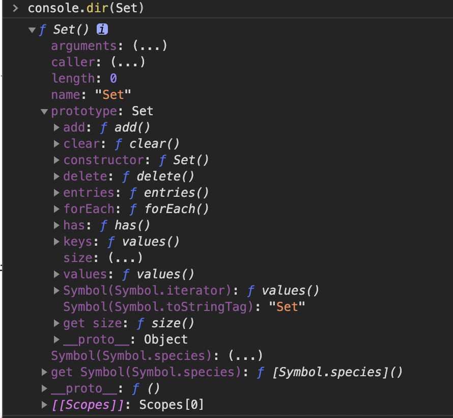

### Set

Set是es6提供的新的数据结构。类似于数组，但它的成员的值都是唯一的，没有重复的值

1、Set的基本用法：
```
Set是一个构造函数，用来生成Set数据结构

var newSet = new Set([1,2,3,1,2]) // {1, 2, 3}
newSet.add(1) // Set(4) {1, 2, 3}
newSet.add(4) // Set(4) {1, 2, 3, 4}

Set可以接受一个数组（可迭代iterable接口的数据结构）作为参数。来初始化生成一个Set类型（不重复）的值。

通过add()方法可以看出，Set类型的值，不会添加重复的值

因此结合扩展运算符。我们可以使用Set来达到数组去重的作用
[...new Set([1,1,,1,1,1,1,12,2])] // [1, undefined, 12, 2]

结合之前学的。字符串也是一个可迭代（iterable）的数据结构.并且会将字符串转换为字符数组的形式。
[...new Set('cjmcjm')] // ['c', 'j', 'm']
```
注意：处理NaN的时候。需要单独记忆
```
var a = NaN
var b = NaN
new Set().add(a).add(b).add(1) // Set(2) {NaN, 1}

我们都知道NaN !== NaN.但是在Set内部，会将多个NaN处理成相等，从而只取一个

var a = {a:1}
var b = Object.assign(a, {}) // 浅拷贝
new Set().add(a).add(b) // Set(1) {{…}}
var c = JSON.parse(JSON.stringify(a)) // 深拷贝
new Set().add(a).add(b).add(c) // Set(2) {{…}, {…}}
```
#### 2、Set的实例和方法

```
重上图我们可以知道。
```