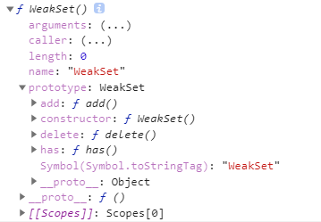
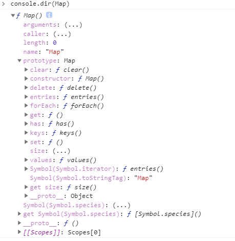
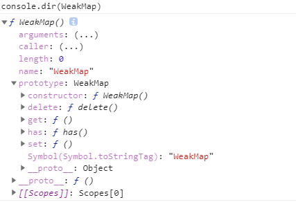

Map和Set都可以接收一个参数
```
new Map([[{},1],[{},1]]) // Map(2) {{…} => 2, {…} => 2}
new Set([[[],1],[[],1]]) // Set(2) {Array(2), Array(2)}
```

### Set

Set是es6提供的新的数据结构。类似于数组，但它的成员的值都是唯一的，没有重复的值

1、Set的基本用法：
```
Set是一个构造函数，用来生成Set数据结构

var newSet = new Set([1,2,3,1,2]) // {1, 2, 3}
newSet.add(1) // Set(4) {1, 2, 3}
newSet.add(4) // Set(4) {1, 2, 3, 4}

Set可以接受一个数组（可迭代iterable接口的数据结构）作为参数。来初始化生成一个Set类型（不重复）的值。

通过add()方法可以看出，Set类型的值，不会添加重复的值

因此结合扩展运算符。我们可以使用Set来达到数组去重的作用
[...new Set([1,1,,1,1,1,1,12,2])] // [1, undefined, 12, 2]

结合之前学的。字符串也是一个可迭代（iterable）的数据结构.并且会将字符串转换为字符数组的形式。
[...new Set('cjmcjm')] // ['c', 'j', 'm']
```
注意：处理NaN的时候。需要单独记忆
```
var a = NaN
var b = NaN
new Set().add(a).add(b).add(1) // Set(2) {NaN, 1}

我们都知道NaN !== NaN.但是在Set内部，会将多个NaN处理成相等，从而只取一个

var a = {a:1}
var b = Object.assign(a, {}) // 浅拷贝
new Set().add(a).add(b) // Set(1) {{…}}
var c = JSON.parse(JSON.stringify(a)) // 深拷贝
new Set().add(a).add(b).add(c) // Set(2) {{…}, {…}}
```
#### 2、Set的实例属性和方法

```
Set是一个构造函数。从上图我们可以知道。在构造函数的prototype上有很多属性。  

var newSet = new Set()
add() // 添加一个值(能链式)。如果已经存在，则不添加
newSet.add(1).add(2) // Set(2) {1, 2}

size属性: 表示实例的值的个数
newSet.size // 2

delete() // 删除一个值(不能链式)，如果存在则删除，并返回treu,如果不存在，返回false
newSet.delete(1) // true
newSet.delete(0) // false

has() // 判断该值是否存在。存在返回true,不存在返回false
newSet.has(2) // true
newSet.has(1) // false

clear() // 清空当前实例的值
newSet.clear()


keys() // 与对象keys方法类似（返回值的集合）
values() // 与对象的values方法类似（返回值得集合）
kyes()和values()的返回的值一致。（由于Set结构没有键名，只有键值（或者说键名和键值是同一个值））

entries() // 和对象的entries()类似

对象的keys、values、entries方法返回是数组。而Set的keys、values、entries方法返回的是可迭代的值（SetIterator {1, 2}）

forEach():用于对每个成员执行某种操作，没有返回值。

var a = new Set().add(1).add(2)
a.forEach(function(item,index,arr){ // 键值、键名、集合本身
    console.log(item,index,arr)
})
// 1 1 Set(2) {1, 2}
// 2 2 Set(2) {1, 2}
```

WeakSet： 对象允许你将弱引用对象存储在一个集合中。

WeakSet的结构和Set类似，也是不重复的值的集合。但是，它与Set有两个不同。

1、首先，WeakSet的成员只能是对象，而不能是其他类型的值

2、其次，WeakSet中的对象引用都是弱引用，即垃圾回收机制不考虑WeakSet对该对象的引用。如果说其他对象都不在引用WeakSet中的弱引用对象，那么垃圾回收机制会自动回收该对象所占用的内存，不考虑该对象还在WeakSet中。这也是WeakSet不能遍历的原因



```
var newWeakSet = new WeakSet()
var a = [1,2]
var b = {a:1}
var c= function(){}
newWeakSet.add(a) // WeakSet {Array(2)}
newWeakSet.add(b)  // WeakSet {{…}, Array(2)}
newWeakSet.add(c) // WeakSet WeakSet {{…}, ƒ, Array(2)}

newWeakSet.has(a) // true( 存在：true，不存在false)

newWeakSet.delete(a) // 删除成功，返回true,删除不存在的，返回false
newWeakSet.has(a) // false

从上图我们可以看出。WeakSet没有size属性，所有，这个也不能作为不能遍历的原因
```

### Map

Map的基本使用
```
javascript的对象（本质上键值对的集合（Hash结构）），但是传统上只能使用字符串作为对象的键值。这给它带来很大的限制

例如：
var a = {}
var nodeList = document.querySelectorAll('div')

a[nodeList] = 1
console.log(a) // {[object NodeList]: 1}

会将非字符串的值，转化为字符串。

ES6为了解决这个问题，引入了Map数据结构。它类似对象，也是键值对的集合。但有区别与传统的对象，Map数据结构的键值，不仅仅可以是字符串，也可以是对象等作为键值。

```

接下来。我们整体的来看下Map的实例方法和属性


```
var a = {a: 1}
var b = {}
var newMap = new Map()
newMap.set(a, 1) // Map(1) {{…} => 1}
newMap.set(a, 2) // Map(1) {{…} => 2}

从上面我们可以知道，给Map的实例添加同一个键值，不会重复添加，只会覆盖

newMap.get(a) // 2 get方法是获取对应的value值
newMap.get(c) // undefined 读取一个不存在的值，返回undefined

newMap.has(a) // true has方法检测当前实例中是否有这个键

newMap.delete(a) // true 返回一个boolean值。删除实例当中的键值。true代表成功，false代表失败

newMap.delete(b) // false

newMap.has(a) // false

newMap.set(a, 1).set(b, 2) // Map(2) {{…} => 1, {…} => 2}

Map实例的set方法可以链式调用

newMap.set(a, 1).get(a)

newMap.size // 2  size属性。获取当前实例的成员的个数。

newMap.clear() // 清空实例中的值。没有返回值（undefined）

```

```
Map原生提供三个遍历器生成函数和一个遍历方法。
keys()：返回键名的遍历器。
values()：返回键值的遍历器。
entries()：返回所有成员的遍历器。
forEach()：遍历Map的所有成员。

这些方法和 Set的非常类似
```

```
与其他数据结构的转换

（1）Map转为数组
var a = new Map([[{},1],[{},2]])
console.log([...a]) // [[{},1], [{},2]]

（2）数组转为Map
var a = new Map([[{},1],[{},2]])
console.log(a) // Map(2) {{}:1, {}:2}

（3）Map转为对象
var a = new Map([[{},1],[{},2]])
for(var i of a.entries()) {
    console.log(i) 
    // [{}, 1]
    // [{}, 2]
}
for(var [key, value] of a.entries()) {
    console.log(key,value) 
    // {}, 1
    // {}, 2
}
for(var [key, value] of a) {
    var obj = Object.create(null)
    obj[key] = value
    console.log(obj)
    // {[object Object]: 1}
    // {[object Object]: 2}
}
从这个例子 我们可以看到。可以直接遍历 Map的实例，和调用实例的entries()的一致。

（3）对象转为Map
var obj = {a: 1, b: 2}
var newMap = new Map()
for (var i of Object.keys(obj)) {
    newMap.set(i, obj[i])
}
// Map(2) {"a" => 1, "b" => 2}
```

### WeakMap

WeakMap结构与Map结构基本类似，唯一的区别是它只接受对象作为键名（null除外），不接受其他类型的值作为键名，而且键名所指向的对象，不计入垃圾回收机制。



WeakMap拥有的set、get、has、delete方法的用法和Map是一样的