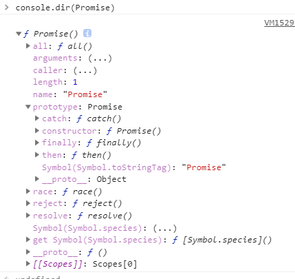

什么是Promise

Promise是什么？不论是es6的Promise,还是jquery的promise.不同的库有不同的实现，但是大家遵守统一的规范，所有，Promise不是指定的某一个实现，**而是一种规范，是一套处理javascript异步的机制**

Promise的规范有很多，如Promise/A、Promise/B、Promise/D以及Promise/A的升级版Promise/A+，其中ES6遵循Promise/A+规范，有关Promise/A+，你可以参考一下：

* 英文版：[Promise/A+](https://promisesaplus.com/)
* 翻译版：[Promise/A+翻译](https://www.ituring.com.cn/article/66566)

promises的核心思想是：promise代表异步操作的结果。 一个承诺处于三种不同状态之一：

* pending(待定)：Promise的初始状态

* Fulfilled(已完成)：Promise的完成状态

* rejected(已拒绝)：Promise的拒绝状态

只有异步操作的结果，可以决定当前是是哪一种状态。任何其他操作都无法改变这个状态。

一旦状态改变，由pending状态变更为已完成或已拒绝的状态，它就不会再改变（即永远无法再改变）。

状态的改变仅且只有两种可能

* 1、pending -> fulfilled (待定 -> 已完成)
* 2、pending -> rejected (待定 -> 已拒绝)

如果改变已经发生了，你再对Promise对象添加回调函数，也会立即得到这个结果。

```
var a = new Promise(function(resolve,reject){
	resolve(1)
})

a.then(res=>{console.log(res)}) // 1
a.then(res=>{console.log(res)}) // 1
a.then(res=>{console.log(res)}) // 1

```
Promise 也有一些缺点：

    * 无法取消Promise。一旦创建它就会立即执行，无法中途取消
    * 如果不设置回调函数,promise内部抛出错误,不会反应到外部。
    * 当处于pending状态时，无法得知目前进展到哪一个阶段



从上图可以看出。

Promise对象是一个构造函数，用来生成Promise实例。

```
var a = new Promise(function(resolve, reject) {
    // ... some code

    if (/* 异步操作成功 */){
        resolve(value)
    } else {
        reject(error)
    }
})
```

Promise构造函数接受一个函数作为参数，该函数有两个参数，分别是resolve（解决）和reject（拒绝）。它们是两个函数，有javascript引擎提供，不需要自己部署。

resolve的作用是：将Peomise对象的状态，从pending变成fulfilled。并将异步的结果当作参数传递出去。

reject的作用：将Promise对象的状态，从pending转换为rejected。并将错误的信息当作参数传递出去

Promise实例生成后，可以用then方法分别指定resolve和reject的回调函数

```
a.then(
    (res)=> {
        console.log(res)
    }, 
    (err) => {
        console.log(err)
    }
)
// then函数可以接受两个回调函数作为参数,第一个回调函数在状态由pending转换为fulfilled时执行，第二个回调函数在状态由pending转换为rejected的时候执行。这两个回调函数都能接受Promise对象传出的值
```
resolve函数的参数除了正常的值以外，还可能是另一个 Promise 实例:如下

```
var p1 = new Promise(function (resolve, reject) {
  // resolve(2222222)

  // reject(111111)
})
var p2 = new Promise(function (resolve, reject) {
  setTimeout(() => resolve(p1), 1000)
})

p2.then(result => console.log(result, 'a')).catch(error => console.log(error, 'b')) 
// 如果p1是resolve则打印2222222,'a'；如果p1是reject则打印111111,'b'
```
从上面例子中，p1和p2都是promise的实例。但是p2的resolve方法的参数是p1。即一个异步操作的结果是返回另一个异步操作。

注意：这时的p1的状态会传给p2，也就是。p1的状态决定了p2的状态。如果p1的状态是pending，那么p2的回调函数就会等待p1的状态改变；如果p1的状态已经是fulfilled或者rejected，那么p2的回调函数将会立刻执行。

```
<script>
    var p1 = new Promise(function (resolve, reject) {
        setTimeout(() => reject(new Error('fail')), 3000)
    })

    var p2 = new Promise(function (resolve, reject) {
        setTimeout(() => resolve(p1), 1000)
    })

    p2
    .then(result => console.log(result, 111))
    .catch(error => console.log(error, 222))
    // Error: fail 222
</script>
// 通过上述的描述，这个就很好理解了。结合事件循环来讲述执行顺序
// 1、首先宏任务script 会执行分别执行p1和p2。
// 2、并将p1内的settimeout和p2内的settimeout（settimeout宏任务）放入宏任务队列中。
// 3、执行p2.then()方法。创建promise的并不是个微任务。而是它的.then()方法是个微任务。
// 4、这个时候p2的promise状态依旧是pending.
// 5、开始执行settimeout宏任务。一秒后，p1的状态变为fulfilled。但是因为resolve接受的是一个promise作为参数。所以，p1的状态由p2的状态决定，3秒后，p2的状态变为rejected。最后，p1的状态由pending转换为p2的状态变为rejected,最后，在catch中回调打印出结果 Error: fail, 222
```

注意，调用resolve或reject并不会终结 Promise 的参数函数的执行。

```
new Promise((resolve, reject) => {
  resolve(1);
  console.log(2);
}).then(r => {
  console.log(r);
});
// 2
// 1
```

Promise.prototype.then

从上方的图片，我们可以知晓。Promise的then方法，是挂载在构造函数Promise的原型对象Promise.prototype上的。它的作用是为Promise实例添加状态改变时的回调函数。then方法接手两个回调函数作为参数，第一个回调函数是在状态变为fulfilled是调用，第二个是在状态变为rejected时调用。

then方法返回的是一个新的Promise实例（不是原来的Promise实例）。因此可以采用链式写法，即then后面在调用一个then.如下示例：

```
Promise.resolve(1).then(res=>{console.log(res); return 2}).then(res=>console.log(res))

// 1
// 2
```
Promise.prototype.catch

Promise.prototype.catch等价于.then(null, function(){}),用于指定发生错误时的回调

```
var a = new Promise(function(resolve, reject) {
    // throw new Error('测试抛错误')
    reject(new Error('测试抛错误'))

    // 上下两种写法都可以
    // 对比上下两种，可以发现reject方法的作用，等同于抛出错误。
})
a.then(res => console.log(res), error => console.log(error))
a.catch(error => console.log(error))
// 上下都是一致的。都打印这个异常  Error: 测试抛错误
```
如果异步操作抛出错误，状态就会变为rejected，就会调用catch方法指定的回调函数，处理这个错误。另外，then方法指定的回调函数，如果运行中抛出错误，也会被catch方法捕获。

注意：如果Promise的状态已经变为fulfilled。这个时候抛出的异常，不能被catch捕捉到;示例如下

```
var a = new Promise(function(resolve, reject){
    resolve(1)
    throw new Error('测试抛错误')
})
a.then(res=>console.log(res)).catch(error => console.log(error))

// 1
```

promise的对象的错误会一直向后传递，直至被catch到为止。也就是说，错误总是会被下一个catch语句捕获。

```
var a = new Promise(function(resolve, reject){
    resolve(1)
})
a.then(res=>{console.log(res); return 2})
.then(res=>{console.log(res); new Error('错误')})
.then(res=>{console.log(res); return 3})
.then(res=>{console.log(res); return 4})
.catch(error => console.log(error))

// 1
// 2
// Error: 错误
// 3
// 4

// 从上面例子我们可以看到。不论在then的那个阶段，都能被catch捕获到对应错误。
```

```
var a = function() {
  return new Promise(function(resolve, reject) {
    // 下面一行会报错，因为x没有声明
    resolve(x + 2);
  });
};

a().then(function() {
  console.log('everything is great');
});

setTimeout(() => { console.log(123) }, 2000);
// Uncaught (in promise) ReferenceError: x is not defined
// 123（2秒后执行）

// 我们可以看到，上面的例子，虽然会报错，但是不会阻断代码的执行
// Promise 内部的错误不会影响到 Promise 外部的代码，通俗的说法就是“Promise 会吃掉错误”。
```

catch方法返回的还是一个 Promise 对象，因此后面还可以接着调用then方法。


Promise.prototype.finally()：注意：回调的方法不接受任何参数

Promise.prototype.finally()方法 是es2018引入标准的

它表示，不论Promise对象的状态是fulfilled还是rejected.都会执行的操作（promise状态为pending时，不会执行）

```
var a = new Promise(function(resolve, reject){
    // resolve(1)

    resolve(1)
    // 或 reject(1)
})
a.finally(() => {console.log(2222)})

// 当resolve(1) 注释的时候，不打印2222
// 当放开注释时；不论promise的状态是什么，只要有转变，就会打印2222
// 注意：回调的方法不接受任何参数

finally方法的回调函数不接受任何参数，这意味着没有办法知道，前面的 Promise 状态到底是fulfilled还是rejected。

这表明，finally方法里面的操作，应该是与状态无关的，不依赖于 Promise 的执行结果。
```

```
var a = new Promise(function(resolve, reject){
    resolve(1)
})
a.then(res => {console.log(res); return 2})
.finally(() => {console.log(2222)})
.then(res => {console.log(res);})

a.then(res => {console.log(res);})
.finally(() => {console.log(2222)})
.then(res => {console.log(res);})
```

```
// 实现
Promise.prototype.finally = function (callback) {
  let P = this.constructor;
  return this.then(
    value  => P.resolve(callback()).then(() => value),
    reason => P.resolve(callback()).then(() => { throw reason })
  );
};
// 从上面的实现还可以看到，finally方法总是会返回原来的值。
```
例子：
```
var a = new Promise(function(resolve, reject){
    resolve(1)
})
a.then(res => {console.log(res); return 2})
.finally(() => {console.log(2222)})
.then(res => {console.log(res);})

a.then(res => {console.log(res);})
.finally(() => {console.log(2222)})
.then(res => {console.log(res);})

// 1
// 1

// 2222
// 2222

// 2
// undefined
```

Promise.all()

作用：将多个Promise对象包装成一个Promise对象
```
语法：var a = Promise.all([p1, p2, ..., pn])
Promise.all 接收一个数组作为参数。数组中每一项都是Promise的实例,
如果不是，会先调用Promise.resolve()方法，将它转化为promise的实例，再进一步处理。
（Promise.all方法的参数可以不是数组，但必须具有 Iterator 接口，且返回的每个成员都是 Promise 实例。）
```

上述例子中的p的状态：由数组内的每一项决定。分两种情况。

    * 当数组内每一项的Promise的状态都从pending转化为fulfilled时。p的状态便为fulfilled,此时p1、p2、p3的返回值组成一个数组，传递给p的回调函数。

    * 当数组内有一项的Promise的状态都从pending转化为rejected时,p的状态便为rejected.并且第一个rejected的实例的返回值，传递给p的回调函数

```
// 生成一个Promise对象的数组
var a = [2, 3, 5, 7, 11, 13].map(function (id) {
  return new Promise(function(resolve, reject){
      resolve(id)
  })
});
Promise.all(a).then(function (posts) {
  console.log(posts)
}).catch(function(reason){
  // ...
});
// 打印 [2, 3, 5, 7, 11, 13]
```

```
var a = Promise.resolve(1)
var b = Promise.resolve(2)
// var c = Promise.reject(new Error('错误'))
var c = Promise.reject(new Error('错误')).catch()
var d = Promise.resolve(3)
var e = Promise.reject(new Error('错误1'))
Promise.all([a,b,c,d,e]).then(function (posts) {
  console.log(posts)
}).catch(function(reason){
  console.log(reason)
});
// Error: 错误 (c未catch的时候，all方法打印)
// Error: 错误1 (c catch的时候，all方法打印)

// 从上面的例子我们可以看到。在c 未catch的时候，会被all方法捕获错误，但是catch之后，由于catch方法会返回一个promise的实例，所有c就算是rejected的，它的错误依旧不会被捕获
```


Promise.race() （race英文表示竞争）

作用：同样是将多个 Promise 实例，包装成一个新的 Promise 实例。

```
var p = Promise.race([p1, p2, p3])

// race英文意思有竞争的意思。顾名思义。
就是将数组中的每一项，那个状态先改变，p的状态就跟着第一个改变的而改变。

var a = new Promise((resolve, reject)=>{
    setTimeout(()=>{
        resolve(1)
    }, 1000)
})
var b = new Promise((resolve, reject)=>{
    setTimeout(()=>{
        reject(new Error('错误'))
    }, 5000)
})
Promise.race([a,b]).then(res=>{
    console.log(res)
}).catch(err=>console.log(err))

// 当b的状态先变时，Promise.race的状态便为rejected.
// 当a的状态先变时，Promise.race的状态便为fulfilled.
```


Promise.resolve()
作用：将现有对象转为 Promise 对象，Promise.resolve方法就起到这个作用。
```
Promise.resolve()的方法相当于

new Promise(function(resolve, reject) {
    resolve()
})

// resolve的参数分为四种情况

// 1、当参数是一个Promise实例的时候，那么Promise.resolve将不做任何修改、原封不动地返回这个实例。

// 2、当参数是一个具有then方法的对象（thenable对象）
var thenable = {
    then: function(resolve,reject){
        resolve(42)
    }
}
Promise.resolve()会将这个对象转为Promise对象，并立即执行.then()方法。

let thenable = {
  then: function(resolve, reject) {
    resolve(42);
  }
};

let p1 = Promise.resolve(thenable);
p1.then(function(value) {
  console.log(value);  // 42
});

// 3、参数不是任何对象。

Promise.resolve(1)返回一个Promise对象，并且状态为fulfilled
相当于
new Promise(function(resolve,reject){
    resolve(1)
})

// 4、不传参数

和第三点类似。只是没有参数而已
```


Promise.reject()

作用：Promise.reject(reason)方法也会返回一个新的 Promise 实例，该实例的状态为rejected。
```
const p = Promise.reject('出错了');
// 等同于
const p = new Promise((resolve, reject) => reject('出错了'))

p.then(null, function (s) {
  console.log(s)
});
// 出错了
```
注意，Promise.reject()方法的参数，会原封不动地作为reject的理由，变成后续方法的参数。这一点与Promise.resolve方法不一致。例子如下

```
const thenable = {
  then(resolve, reject) {
    reject('出错了');
  }
};

Promise.reject(thenable)
.catch(e => {
  console.log(e === thenable)
})
// true
```

https://www.yuque.com/ostwind/es6/docs-promise#704f29e0