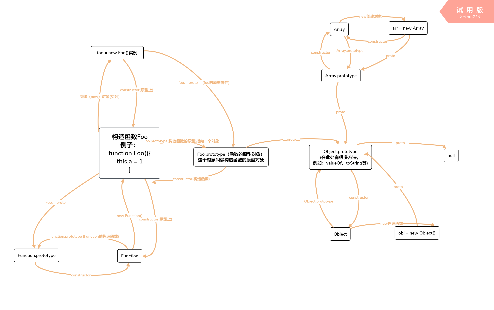

#### **构造函数**

"构造函数"的本质是个函数，通过new 来调用函数，可以生成一个对象。这类的函数统称为“构造函数”。

换句话说，在javascript中对于"构造函数"最准确的解释是，所有带new的函数调用。
函数不是构造函数，但是当且仅当使用new时，函数调用会变成"构造函数调用"。

"构造函数"的命名，习惯上是首字母是大写。"构造函数"需要时用new关键字来调用
```
function Person (name, age) {
    this.name = name
    this.age = age
    this.sayName = function() {
        console.log(this.name)
    }
}

var per = new Person("孙悟空", 18)
per.sayName()// 孙悟空
typeof per // Object
```
分别打印 per 和 Person


从图一我们可以看出。在创建一个Person的构造函数时，会为当前这个对象per添加上对应的属性age和name以及sayName方法。也就是说。每次使用new调用构造函数时，都会为新的对象添加对应的属性和方法。


从上图二我们可以知道。当定义一个函数时。都会存在一个prototype属性。这个属性的构造函数contructor指向它自己

所有：Person.prototype.contructor === Person // true


#### 原型

在js中，每个对象都有自己的原型，当我们访问对象的属性和方法时，js会先访问对象本身的方法和属性，如果对象本身不包含这些属性和方法，则访问对象对应的原型。

1、prototype

如上图二。我们可以知道，所有的函数都拥有一个prototype（显示原型属性）的属性。prototype的属性值也是一个属性。

因此。如果上诉例子Person，在创建100个Person构造函数的实例对象时，会创建100个对应的sayName方法。而且方法都是一摸一样的。因此，我们可以将，构造函数的方法或者属性定义在构造函数的prototype属性上。

```
function Person (name, age) {
    this.name = name
    this.age = age
    this.sayName = function() {
        console.log(this.name)
    }
}
Person.prototype.sayName = function () {
    console.log(this.name)
}
var per = new Person("孙悟空", 18) 
per.sayName()// 孙悟空
```

#### **\_\_proto__**

每个对象都有一个隐式的原型属性（称之为__proto__）指向了创建该对象的构造函数的原型。也就是指向构造函数的prototype属性。

如图一。per.\_\_proto__ === Person.prototype // true


#### [[Prototype]]

[[Prototype]] 是对象的一个内部属性，外部代码无法直接访问。

#### 注意

\_\_proto__属性在es6是才被标准化，以保证web浏览器的兼容性。但是不推荐使用，除了标准化的原因之外，还有性能问题。为了更好的支持，推荐使用 Object.getPrototypeOf()。

mdn上解释：

警告: 通过现代浏览器的操作属性的便利性，可以改变一个对象的 [[Prototype]] 属性, 这种行为在每一个JavaScript引擎和浏览器中都是一个非常慢且影响性能的操作，使用这种方式来改变和继承属性是对性能影响非常严重的，并且性能消耗的时间也不是简单的花费在 obj.__proto__ = ... 语句上, 它还会影响到所有继承来自该 [[Prototype]] 的对象，如果你关心性能，你就不应该在一个对象中修改它的 [[Prototype]]。相反, 创建一个新的且可以继承 [[Prototype]] 的对象，推荐使用 Object.create()。


如果需要读取或修改__proto__的值。更推荐使用Object.getPrototypeOf/Reflect.getPrototypeOf 和Object.setPrototypeOf/Reflect.setPrototypeOf（尽管如此，设置对象的[[Prototype]]是一个缓慢的操作，如果性能是一个问题，应该避免）

如果需要创建一个新对象，并且继承其他对象的原型。推荐使用 Object.create()

Object.create()方法创建一个新对象，使用现有的对象来提供新创建的对象的__proto__。

总结：

    1、所有的引用类型都有对象特性
    2、所有引用类型都有它的原型属性（函数有prototype属性。数组或者对应有__proto__属性。）。它们的原型属性也是一个对象，该对象的也有自己的原型属性，层层向上查找，直到原型属性为null为止（因为null没有原型，所有，null是重点）。
    3、当试图得到一个对象的属性的时候，会先在对象本身去查找有没有对应的属性。如果没有，会顺着**原型链**一层一层向上查找，直到为null为止。则返回undefined

#### 原型链

每一个对象都有它的原型对象，通过__proto__指针指向上一层原型。并从中**继承方法和属性**，同时原型对象也有它的原型对象，这样一层一层，最终指向 null，这种关系被称为**原型链**(prototype chain)。根据定义，null 没有原型，并作为这个原型链中的最后一个环节。

原型链的基本思想是利用对象的原型，让一个对象继承另一个对象的属性和方法

最后放一张自己总结的图


