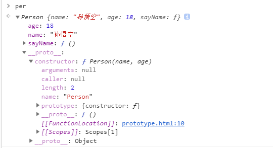
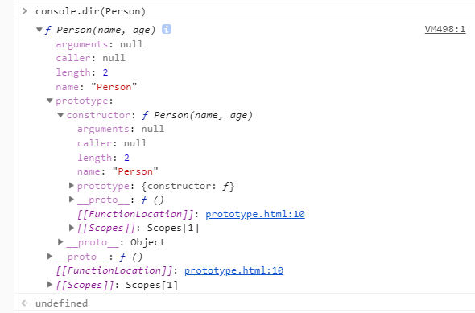
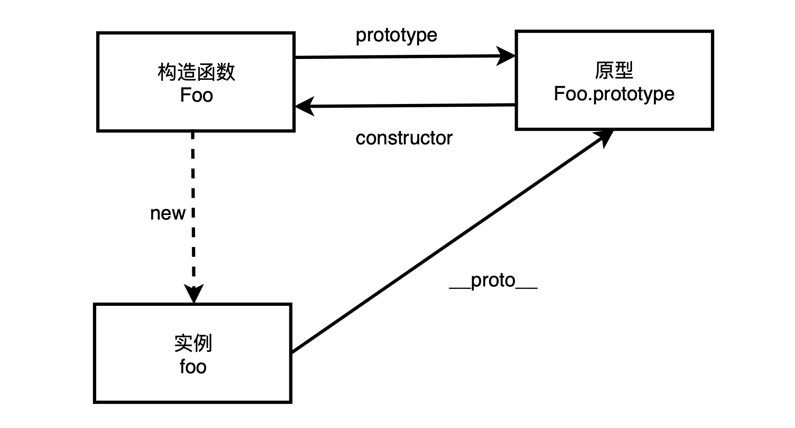

#### **构造函数**

"构造函数"的本质是个函数，通过new 来调用函数，可以生成一个对象。这类的函数统称为“构造函数”。

换句话说，在javascript中对于"构造函数"最准确的解释是，所有带new的函数调用。
函数不是构造函数，但是当且仅当使用new时，函数调用会变成"构造函数调用"。

"构造函数"的命名，习惯上是首字母是大写。"构造函数"需要时用new关键字来调用
```
function Person (name, age) {
    this.name = name
    this.age = age
    this.sayName = function() {
        console.log(this.name)
    }
}

var per = new Person("孙悟空", 18)
per.sayName()// 孙悟空
typeof per // Object
```
分别打印 per 和 Person


从图一我们可以看出。在创建一个Person的构造函数时，会为当前这个对象per添加上对应的属性age和name以及sayName方法。也就是说。每次使用new调用构造函数时，都会为新的对象添加对应的属性和方法。



从上图二我们可以知道。当定义一个函数时。都会存在一个prototype属性。这个属性的构造函数contructor指向它自己

所有：Person.prototype.contructor === Person // true


#### 原型

在js中，每个对象都有自己的原型，当我们访问对象的属性和方法时，js会先访问对象本身的方法和属性，如果对象本身不包含这些属性和方法，则访问对象对应的原型。

1、prototype

如上图二。我们可以知道，所有的函数都拥有一个prototype（显示原型属性）的属性。prototype的属性值也是一个属性。

因此。如果上诉例子Person，在创建100个Person构造函数的实例对象时，会创建100个对应的sayName方法。而且方法都是一摸一样的。因此，我们可以将，构造函数的方法或者属性定义在构造函数的prototype属性上。

```
function Person (name, age) {
    this.name = name
    this.age = age
    this.sayName = function() {
        console.log(this.name)
    }
}
Person.prototype.sayName = function () {
    console.log(this.name)
}
var per = new Person("孙悟空", 18) 
per.sayName()// 孙悟空
```

#### **__proto__**

每个对象都有一个隐式的原型属性（称之为__proto__）指向了创建该对象的构造函数的原型。也就是指向构造函数的prototype属性。

如图一。per.__proto__ === Person.prototype // true



#### [[Prototype]]

[[Prototype]] 是对象的一个内部属性，外部代码无法直接访问。

#### 注意

