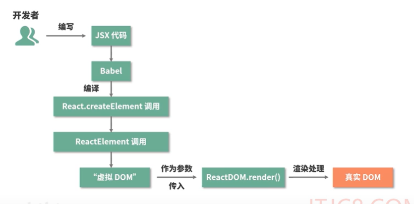
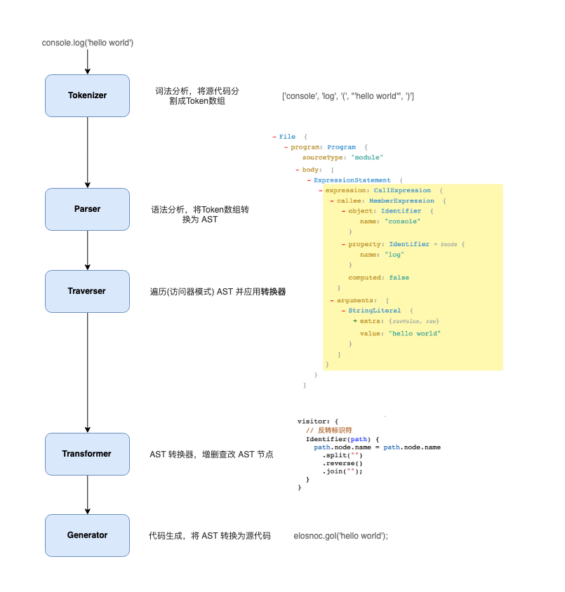

1.jsx的本质是什么，它和js之间是什么关系

    jsx本质是javascript的语法扩展，它和模板语言很接近，但是它区分具备javascript的能力

    浏览器不会天生支持jsx,需要使用babel工具，上图中我们可以，jsx被babel编译为React.createElement(),React,createElement()将返回一个叫做'React Element'的js对象.通过上图。
    
    createElement(type, config, children)
    type: 用于表示节点的类型
    config: 以对象传入，组件所有属性都会以键值对的形式存储在config对象中
    children: 以对象形式传入，它记录的是组件标签之间的嵌套的内容，也就是子元素

    createElement方法返回的是一个ReactElement()，这个ReactElement方法返回的是以 javascript 对象形式存在的对DOM的描述，也就是虚拟DOM.

    最终通过ReactDom.render()方法将虚拟节点变成正式节点挂在在html上
    ReactDom.render(
        //炫耀渲染的元素（ReactElement也就是虚拟dom），
        element,
        // 元素挂载的目标容器（一个真实存在的DOM节点）
        container,
        // 回调函数，可选参数，可以用来处理渲染结果后的逻辑
        [callback]
    )
    
[babel的原理](https://bobi.ink/2019/10/01/babel/)

    bebl是一个工具库，主要将es6及以上的版本代码转换为向后兼容的js语法，以便能够运行在当前和旧版本的浏览器或其他环境中

2.为什么要用jsx？不用会有什么后果

3.jsx背后的功能模块是什么，这个功能模块都做了哪些事情

源码地址：https://github.com/AttackXiaoJinJin/reactExplain/blob/master/react16.8.6/packages/react/src/ReactElement.js