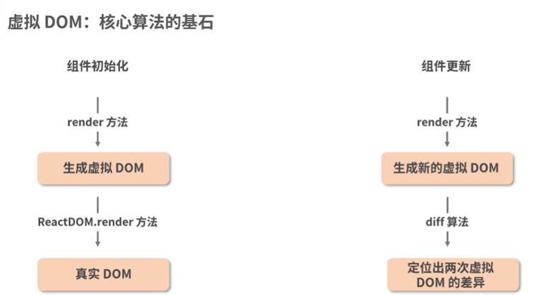
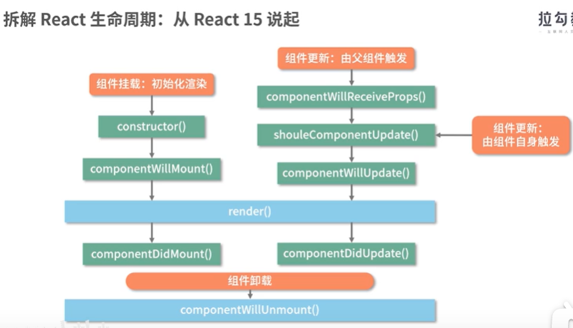
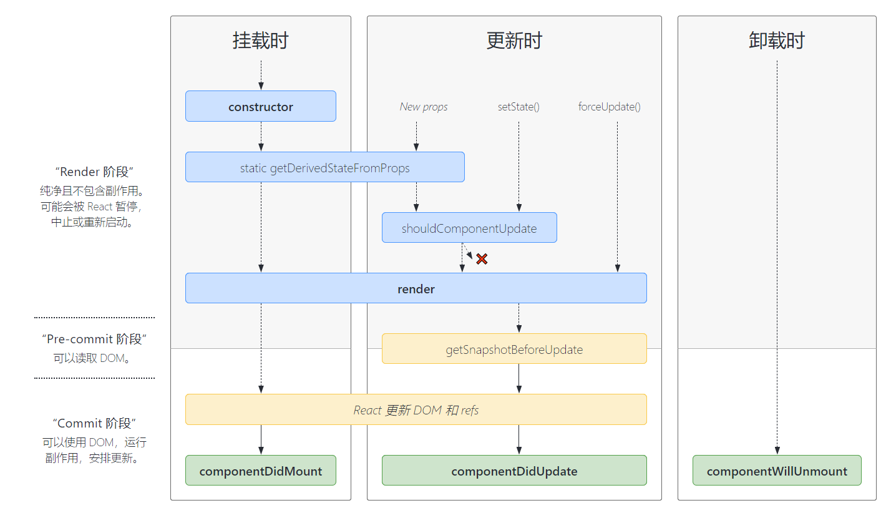
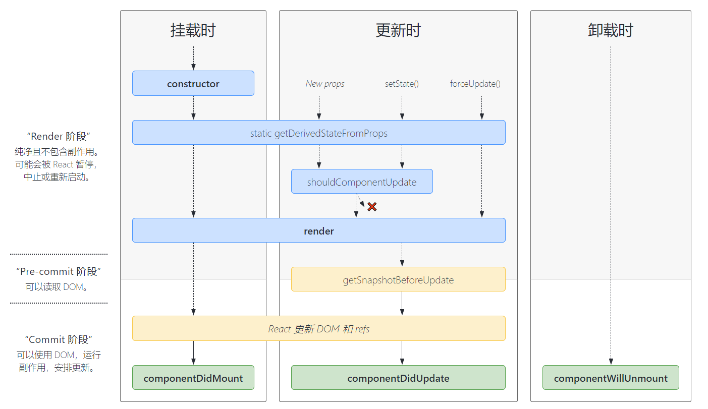
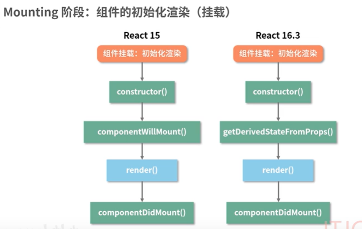

    class LifeCycle extends React.Component {
        render() {
            console.log("render方法执行");
            return (
                

                    this is content
                

            );
        }
    }

render 方法形容为组件的 react 组件的 '灵魂'

render 之外的生命周期方法可以理解为组件的躯干

react15 的生命周期流程。

    import React from "react";
    // 定义子组件
    class LifeCycle extends React.Component {
        constructor(props) {
        console.log("进入constructor");
        super(props);
        // state 可以在 constructor 里初始化
        this.state = { text: "子组件的文本" };
    }
    // 初始化渲染时调用
    componentWillMount() {
        console.log("componentWillMount方法执行,render方法前触发");
    }
    // 初始化渲染时调用
    componentDidMount() {
        console.log("componentDidMount方法执行，真是dom的操作。异步请求，数据初始化可以放在这个生命周期操作");
    }
    // 父组件修改组件的props时会调用
    componentWillReceiveProps(nextProps) {
        // 父组件的更新。会触发这个生命周期的执行
        console.log("componentWillReceiveProps方法执行");
    }
    // 组件更新时调用
    shouldComponentUpdate(nextProps, nextState) {
        // 这个生命周期的返回值决定是否执行之后的生命周期，进而决定是否对组件进行re-render（重新渲染）。默认为true。false就不执行之后的生命周期
        console.log("shouldComponentUpdate方法执行");
        return false;
    }
    // 组件更新时调用
    componentWillUpdate(nextProps, nextState) {
        console.log("componentWillUpdate方法执行, render前执行");
    }
    // 组件更新后调用
    componentDidUpdate(preProps, preState) {
        console.log("componentDidUpdate方法执行，组件更新完毕后被触发，和componentDidMount类似，这个生命周期经常用来处理dom操作");
    }
    // 组件卸载时调用
    componentWillUnmount() {
        // 如果子组件从父组件中移出，或者子组件的key发生改变。此时组件就要被卸载
        // 里面不能操作state,用来解绑事件，删除定时器
        console.log("子组件的componentWillUnmount方法执行");
    }
    render() {
        // render方法在执行过程中，不会去操作真实的dom，返回对应的虚拟dom
        // 真实dom的渲染工作，是在挂载阶段由ReactDom.render来承接的
        console.log("render方法执行");
        return (
            <></>
        );
        }
    }

react 16 生命周期工作流详解

    render方法也做了对应的改变。React16之前，render方法必须返回单个元素，而React16允许我们返回元素数组和字符串。

    getDerivedStateFromProps不是componentWillMount的代替品。准确来说，componentWillMount是被废弃的。没有用途的api为什么还要存在呢？在服务端渲染的场景中componentDidMount是不会被执行的，因此可以在componnetWillMount中发生AJAX请求。

    getDerivedStateFromProps使用的三个要点。
    1、这是一个静态方法。 不依赖组件实例存在。访问不了this
    2、可以接收两个参数。一个是传入的props和当前组件的state
    3、需要一个对象格式的返回值. 更新之后，新属性和原有属性是共存的

    16.3和16.4的区别。就是getDerivedStateFromProps在更新阶段的执行区别。
    16.3中，只有父组件的props更新，才会执行
    16.4是所有情况的更新。都会触发该生命周期

    更新阶段：

    getDerivedStateFromProps是作为一个 试图代替componentWillReceiveProps的API而出现的（可以实现基于props派生state）

    getDerivedStateFromProps不能完全和componentWillReceiveProps划等号(getDerivedStateFromProps能做且只能做上面一件事情。而原来的componentWillReceiveProps能做更多)

    消失的componentWillUpdate和新增的getSnapshotBeforeUpdate

    getSnapshotBeforeUpdate的返回值可以在componentDidUpdate第三个参数获取。（主要用于滚动条。记录上一次位置等需求当中，可能会用到这个生命周期）

    Fiber架构：会将一个大的更新任务拆解为许多小任务。任务拆解，可打断。异步渲染。
    fiber架构的重要特征就是可以呗打断的异步渲染模式，根据能否被打断这一标准，react16的生命周期被划分为render和commit阶段。commit又被细分为commit和pre-commit.
    render阶段可以被打断、中止和重启的。而commit阶段阶段总是同步执行的

https://projects.wojtekmaj.pl/react-lifecycle-methods-diagram/
