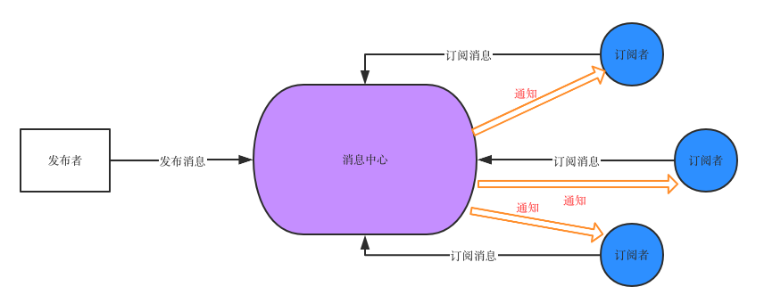
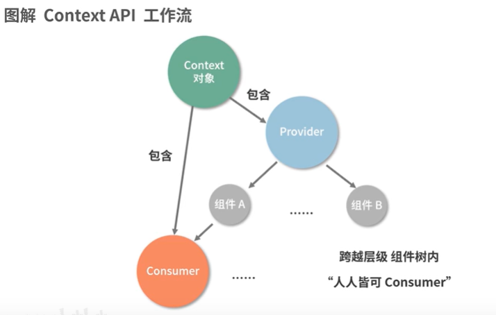
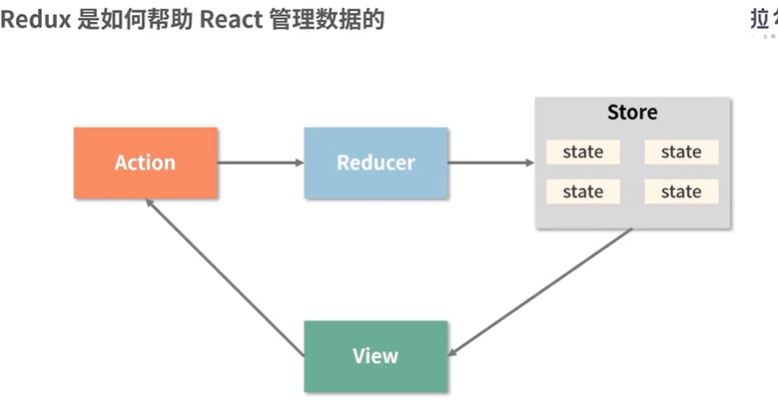
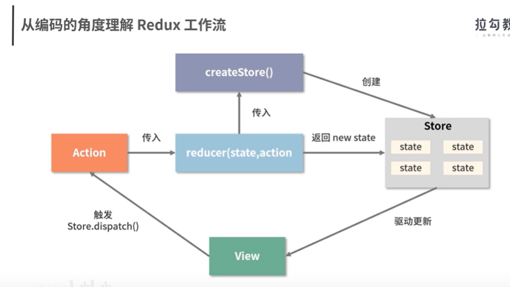

redux。实现

基于 props 的单项数据流（当前的 state 以 props 的形式流动时，只能流向组件树中比自己层级更低的组件）

利用发布订阅-订阅模式驱动数据 。envnt-bus

原生的 target.addEventListener('click',fun, false)

    实现一个发布订阅模式

    class myEventEmitter{
        constructor() {
            this.eventMap = {}
        }
        // type 事件名称
        on (type,handler) {
            // handler必须是一个函数
            if(typeof handler !== 'function') {
                throw new Error('error, handler must is function')
            }
            if(!this.eventMap[type]) {
                this.eventMap[type] = []
            }
            this.eventMap[type].push(handler)
        }
        emit(type, params) {
            if(this.eventMap[type]) {
                this.eventMap[type].forEach((item, index) => {
                    item(params)
                })
            }
        }
        off(type, handler){
            if(this.eventMap[type]) {
                let index = this.eventMap[type].indexOf(handler)
                index > 0 && this.eventMap[type].splice(index, 1)
            }
        }
    }

context api

react.createContext() 创造一个 provide . 可以被 consumer 消费

redux 他提供可预测的状态管理

redux 由三部分组成：

store: 是一个单一的数据流，而且是只读的

action: 是对变化的描述

    const action = {
        type: 'ADD_ITEM', 必传，唯一标识
        payload: '<li>text</li>'
    }

reduce: 是一个纯函数，负责对变化进行分发和处理。将新的 state 返回给 store

派发 action 对数据进行修改
使用 dispatch 派发 action， action 会进入 reducer 里触发对应的更新

store.dispatch(action)

