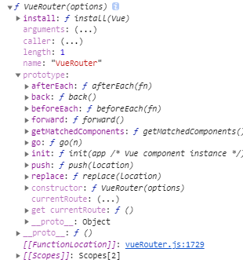

本文vueRouter的源码解析是以2.0.0版[vue-router源码地址](https://github.com/vuejs/vue-router/blob/v2.0.0)(为了方便，使用[外链的方式查看源码](./../vue源码学习/vueRouter.js))

本系列会按照，vue-router官网的目录结构来依次来分析。

* 动态路由匹配（如何将路由和组件匹配）
* 嵌套路由
* 路由模式（hash模式和history模式）
* 导航守卫
* 路由懒加载

在开始分析之前。我们先来了解下实现前端路由的前提条件。比如说

1. 路由名称显示在url上（核心）
2. 可以带参数
3. 路由改变不会引起页面的刷新（核心）
4. 浏览器可以记录路由历史
5. 路由切换无需发送网络请求html

再说vue路由之前，我们先来看下如何实现前端路由，下方链接是使用hash模式和history分别来实现的[hash和history跳转](./router-model.html)


router的源码总共也就1800行左右。接下来我们走进源码

首先我们打印VueRouter(console.dir(VueRouter))



可以看到VueRouter构造函数，在构造函数上添加了install方法，用作vue的插件，另外，判断了是否在浏览器环境中和全局vue的存在，自行安装插件。

```
  var VueRouter = function VueRouter (options) {
    
  };

  VueRouter.install = install

  if (inBrowser && window.Vue) {
    // Vue.use是安装 Vue插件的api.实现方法可以参考vue.js的Vue.use方法   如果插件是一个对象，必须提供 install 方法。如果插件是一个函数，它会被作为 install 方法。
    // 该方法主要是两件事：
    // 1、首先判断是否安装过该插件，如果安装过，就直接return
    // 2、如果没安装过，像Vue的installedPlugins属性（值是数组）中，添加当前插件名
    // 3、判断当前install是不是一个函数，如果是一个函数，则执行这个函数
    // 4、如果install不是一个函数，则说明这个插件时一个函数。
    window.Vue.use(VueRouter)
  }
```
install作为VueRouter的属性。在安装VueRouter插件的时候，实际上是执行install方法
```
  function install (Vue) {  
    // 源码中为什么还需要这个判断呢？在vue.use已经判断过是否安装过插件，个人感觉是多余的判断。  
    if (install.installed) { return }
    install.installed = true
    
    // 向Vue的原型上注入$router和$route
    Object.defineProperty(Vue.prototype, '$router', {
      get: function get () { return this.$root._router }
    })
  
    Object.defineProperty(Vue.prototype, '$route', {
      get: function get$1 () { return this.$root._route }
    })

    Vue.mixin({
      beforeCreate: function beforeCreate () {
        // 判断实例中的$options中是否有router  
        if (this.$options.router) {
          // 给实例的_router 赋值  
          this._router = this.$options.router
          // 初始化init
          this._router.init(this)
          // 实例的_route成响应式
          Vue.util.defineReactive(this, '_route', this._router.history.current)
        }
      }
    })
    // 注册组件
    Vue.component('router-view', View)
    Vue.component('router-link', Link)
  }
```

实例化VueRouter（主要是做初始化实例对象的值，还有一部分初始化实在init方法中进行）

```
// 初始化实例对象的值
this.app = null
this.options = options
this.beforeHooks = []
this.afterHooks = []
// 匹配函数(返回一个match函数)
this.match = createMatcher(options.routes || [])
// 根据传入的值来判断当前路由的模式
var mode = options.mode || 'hash'

//supportsHistory 方法判断当前环境的值
this.fallback = mode === 'history' && !supportsHistory
if (this.fallback) {
    mode = 'hash'
}
if (!inBrowser) {
    mode = 'abstract'
}
// mode 有三种方式 hash、history、abstract
this.mode = mode
```

接下来我们看一下匹配函数 this.match = createMatcher(options.routes || [])
```
// 我们可以看到createMatcher最终会返回一个match函数
function createMatcher (routes) {
    // 根据路由生成pathMap和nameMap
    var ref = createRouteMap(routes);
    var pathMap = ref.pathMap;
    var nameMap = ref.nameMap;
  
    function match (
      raw,
      currentRoute,
      redirectedFrom
    ) {
      return _createRoute(null, location)
    }
  
    function redirect (
      record,
      location
    ) {
      
    }
  
    function alias (
      record,
      location,
      matchAs
    ) {
      
      return _createRoute(null, location)
    }
  
    function _createRoute (
      record,
      location,
      redirectedFrom
    ) {
      
    }
  
    return match
}
// createRouteMap方法主要是生成pathMap和nameMap
// 参数routes 是定义路由：
/**
* [
*   {name:'', path: ''}, {name:'', path: ''},{name:'', path: ''}, {name:'', path: ''}
* ]
**/
function createRouteMap (routes) {
    var pathMap = Object.create(null)
    var nameMap = Object.create(null)
  
    routes.forEach(function (route) {
      addRouteRecord(pathMap, nameMap, route)
    })
    return {
      pathMap: pathMap,
      nameMap: nameMap
    }
}

// addRouteRecord方法
  function addRouteRecord (
    pathMap,// 存储path的数组
    nameMap, // 存储name的数组
    route, // 定义路由数组中的每一个路由
    parent, // 父路由
    matchAs
  ) {
    // 获取对应路由的path和name
    var path = route.path;
    var name = route.name;
    assert(path != null, "\"path\" is required in a route configuration.")
    // 记录路由的对象
    var record = {
      path: normalizePath(path, parent),
      components: route.components || { default: route.component },
      instances: {},
      name: name,
      parent: parent,
      matchAs: matchAs,
      redirect: route.redirect,
      beforeEnter: route.beforeEnter,
      meta: route.meta || {}
    }

    // 如果当前路由存在children属性
    if (route.children) {
      if ("production" !== 'production') {}
      // 则递归增加记录
      route.children.forEach(function (child) {
        addRouteRecord(pathMap, nameMap, child, record)
      })
    }

    // 如果当前路由存在alias属性
    if (route.alias) {
      // 并且属性值是数组
      if (Array.isArray(route.alias)) {
        route.alias.forEach(function (alias) {
          addRouteRecord(pathMap, nameMap, { path: alias }, parent, record.path)
        })
      } else {
        addRouteRecord(pathMap, nameMap, { path: route.alias }, parent, record.path)
      }
    }

    // pathMap和nameMap的数组再相同的情况，后面的会覆盖前面的
    // 向pathMap数组添加path
    pathMap[record.path] = record
    // 向nameMap数组添加name
    if (name) { nameMap[name] = record }
}
```

最后我们介绍一些History类。在构建VueRouter实例的时候，会执行这个类。会创建三个路由模式类（根据mode设置的值来，默认hash）HTML5History、HashHistory、AbstractHistory
```
var History = function History (router, base) {
    this.router = router
    // 应用的基路径（相当于如果设置了这个属性，会在项目启动后，在链接后自动增加对应增加的base值。）
    // 比如我设置了base: '/app', 那么在启动项目会在根路径（/bolg）的前面加上/app/根路径(bolg)
    // 访问的时候去掉base对应的路径也能直接访问：比如上述例子:/bolg也能正常访问对应的页面路径
    this.base = normalizeBase(base)
    this.current = START
    this.pending = null
};
// 并在History的原型上绑定了listen、transitionTo、confirmTransition、updateRoute等方法

var HTML5History = (function(History){
  var HTML5History = function(router, base) {
    History.call(this, router, base)
  }
  
  if ( History ) HTML5History.__proto__ = History;
  HTML5History.prototype = Object.create( History && History.prototype );
  HTML5History.prototype.constructor = HTML5History;

  HTML5History.prototype.go = function(){}
  HTML5History.prototype.push = function(){}
  HTML5History.prototype.replace = function(){}
  HTML5History.prototype.ensureURL = function(){}
  HTML5History.prototype.handleScroll = function(){}
  return HTML5History;
})(History)

var HashHistory = (function(History){
  var HashHistory = function() {

  }
  return HashHistory
})(History)

var AbstractHistory = (function(History){
  var AbstractHistory = function() {

  }
  return AbstractHistory
})(History)
```

以上就是VueRouter的实例化所要执行的。

1、主要是初始化

  * VueRouter.install 作为插件，提供vue.use安装插件VueRouter的方法。
  * 初始化match函数(生成match函数过程，会先将定义的路由生成pathMap和namePath)
  * 初始化History函数，并且会创建三个HTML5History、HashHistory、AbstractHistory构造函数。具体选用那个构造函数创建实例，是根据router中的mode的值来决定


参考链接：[github](https://github.com/DDFE/DDFE-blog/issues/9)以及[知乎](https://zhuanlan.zhihu.com/p/113020046)