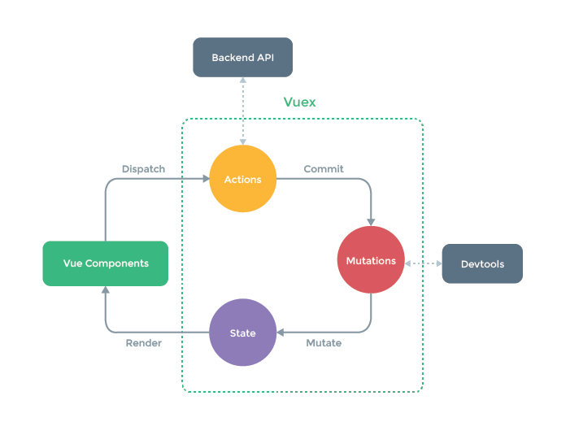

在vue的开发中，我们会遇到如下问题：  
      
    1. 如何让多个vue组件共享状态
    2. vue组件间如何通信

在进入源码之前，我们先看下这个图



[本次分析是以vuex2.0.0版本](https://github.com/vuejs/vuex/blob/v2.0.0/dist/vuex.js)

#### **vuex的使用**
****************************
import Vue from 'vue'  
import Vuex from 'vuex'

Vue.use(Vuex)  
在vuerouter的源码当中，也有类似的调用，我们知道use方法是将执行Vuex当中的install方法。

那我们就先来看下Vuex中的install方法  

```
// install方法是在Vue.use调用的方法。
var Vue // Vuex内定义的变量
function install (_Vue) {
    // 看是否有安装vuex的依赖
    if (Vue) {
        console.error(
        '[vuex] already installed. Vue.use(Vuex) should be called only once.'
        )
        return
    }
    // Vue = 下方调用的install(window.Vue)
    Vue = _Vue
    // 下面再来看下applyMixin这个方法
    applyMixin(Vue)
}

// 这个和router也很像
// 在浏览器环境下&& 存在Vue。则调用install并传入Vue安装Vuex的依赖

if (typeof window !== 'undefined' && window.Vue) {
    install(window.Vue)
}
```

```
function applyMixin (Vue) {
    // 版本号
    var version = Number(Vue.version.split('.')[0])
    // 当前版本>=2
    if (version >= 2) {
      var usesInit = Vue.config._lifecycleHooks.indexOf('init') > -1
      // 向options混入init或者beforeCreate 的vuexInit方法
      Vue.mixin(usesInit ? { init: vuexInit } : { beforeCreate: vuexInit })
    } 
    // 向vue实例的$store注入new Vue中的store(var store = new Vuex.Store)
    // 这也是为什么能够通过this.$store.XXX访问到vuex的各种数据
    function vuexInit () {
      var options = this.$options
      if (options.store) {
        this.$store = options.store
      } else if (options.parent && options.parent.$store) {
        this.$store = options.parent.$store
      }
    }
}
```
那么我们来分析下new Vuex.store(options)

```
 var Store = function Store (options) {
    var this$1 = this;
    // options 如果没传值，将options设置为{}
    // void 0 返回的undefined
    if ( options === void 0 ) options = {};

    // 判断当前当前是否存在Vue。如果不存在则抛出错误
    assert(Vue, `must call Vue.use(Vuex) before creating a store instance.`)

    // 判断当前环境是否可以使用Promise。如果不能使用，则抛出错误
    // vuex的源码是依赖Promise。如果不支持Promise这个es6语法，则需要增加 babel-polyfill 依赖
    assert(typeof Promise !== 'undefined', `vuex requires a Promise polyfill in this browser.`)

    // options中如果没设置state。默认将state = {}
    var state = options.state; if ( state === void 0 ) state = {};
    
    // options中如果没设置plugins。默认将plugins = []
    var plugins = options.plugins; if ( plugins === void 0 ) plugins = [];

    // options中如果没设置pstrict。默认将strict = []
    var strict = options.strict; if ( strict === void 0 ) strict = false;
  
    // 初始化Store的内部属性
    this._options = options // 存储options的值
    this._committing = false // 标志一个提交状态，作用是保证对 Vuex 中 state 的修改只能在 mutation 的回调函数中，而不能在外部随意修改 state。
    this._actions = Object.create(null) // 存储定义的所有的actions
    this._mutations = Object.create(null) // 存储定义的所有mutations
    this._wrappedGetters = Object.create(null) // 存储定义的所有Getters
    this._runtimeModules = Object.create(null) // 存储运行的所有modules
    this._subscribers = [] // 存储所有对 mutation 变化的订阅者。
    this._watcherVM = new Vue() // 是Vue的一个实例。主要利用vue的watch来监测变化
  
    // bind commit and dispatch to self
    // 将Store类的dispatch和commit的this指向store的实例上
    var store = this
    var ref = this;
    var dispatch = ref.dispatch;
    var commit = ref.commit;
    this.dispatch = function boundDispatch (type, payload) {
      return dispatch.call(store, type, payload)
    }
    this.commit = function boundCommit (type, payload, options) {
      return commit.call(store, type, payload, options)
    }
  
    // strict mode
    // 是否开启严格模式（在严格模式下会观测所有的 state 的变化，建议在开发环境时开启严格模式，线上环境要关闭严格模式，否则会有一定的性能开销。）
    this.strict = strict
  
    // 重点的这个installModule。下方单独拉出来分析。.
    // 总的来说,是注册options传入的各个属性模块的注册和安装
    // init root module.
    // this also recursively registers all sub-modules
    // and collects all module getters inside this._wrappedGetters
    installModule(this, state, [], options)
  
    // initialize the store vm, which is responsible for the reactivity
    // (also registers _wrappedGetters as computed properties)
    resetStoreVM(this, state)
  
    // apply plugins
    plugins.concat(devtoolPlugin).forEach(function (plugin) { return plugin(this$1); })
  };
```

```
  /**
   * @function installModule: options(module)传入的各个属性模块的注册和安装
   * @param {Object} store: new Store的实例
   * @param {Object} rootState: 初始化new Store时传入的state的值.如果不存在则为{}
   * @param {Array} path: 当前嵌套模块的路径数组
   * @param {Object} module: 当前安装的模块
   * @param {Boolean} hot: 
   */
  function installModule (store, rootState, path, module, hot) {
    var isRoot = !path.length
    var state = module.state;
    var actions = module.actions;
    var mutations = module.mutations;
    var getters = module.getters;
    var modules = module.modules;
  
    // set state
    // 当前嵌套模块的路径不是根目录 && !hot
    if (!isRoot && !hot) {
      var parentState = getNestedState(rootState, path.slice(0, -1))
      var moduleName = path[path.length - 1]
      store._withCommit(function () {
        // 让state数据变得可侦测
        Vue.set(parentState, moduleName, state || {})
      })
    }
    
    if (mutations) {
      Object.keys(mutations).forEach(function (key) {
        registerMutation(store, key, mutations[key], path)
      })
    }
  
    if (actions) {
      Object.keys(actions).forEach(function (key) {
        registerAction(store, key, actions[key], path)
      })
    }
  
    if (getters) {
      wrapGetters(store, getters, path)
    }

    // 这个比较容易理解.如果存在modules是一个模块.则将模块中的每一个进行installModule注册和安装
    if (modules) {
      Object.keys(modules).forEach(function (key) {
        installModule(store, rootState, path.concat(key), modules[key], hot)
      })
    }
  }
```
其中_withCommit,是让state中的值变得可监测,调用Vue的set方法
```
Store.prototype._withCommit = function _withCommit (fn) {
    var committing = this._committing
    this._committing = true
    fn()
    this._committing = committing
  };
```