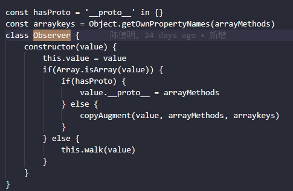

## 1.前言
第一篇文章我们介绍了object的变化侦测。object的变化侦测主要是应用Object.defineProperty方法在getter进行依赖收集，setter进行通知依赖更新。

而数组可以通过数组的原型上的方法来改变数组的内容。所以Object的通过getter和setter的方法就行不通。

在es6之前。javascript没有提供元编程的能力，也就没有提供可以拦截原型方法的能力。但是我们可以自定义的方法去覆盖原生的原型方法


### 2.数组的依赖收集

Array型数据还是在getter中收集依赖（Object也一样）

为什么这么说呢？因为,我们在定义data的时候。
```
data(){
    return {
        arr: []
    }
}
这个arr始终都是在data函数的返回值对象{}中，因为在要使用arr这个数据时，会先从返回值对象中读取这个arr数据。在读取的时候，就会触发arr的getter。所以我们就可以在getter中收集这个依赖。
```
### 3.使数组变成可侦测

#### 3.1 数组方法拦截器
```
const arrayProto = Array.prototype // Array的原型（这上方有array的一些方法,如上图）
export arrayMethods = Object.create(arrayProto) // 创建一个继承Array.prototype的对象

[
    'push',
    'pop',
    'unshift',
    'shift',
    'splice',
    'sort',
    'reverse'
].forEach(function(method){
    var original = arrayMethods[method] // 原生的方法
    Object.defineProperty(arrayMethods, method, {
        value: function mutator(...argus) {
            return original.apply(this, argus)
        },
        enumerable: false,
        writable: true,
        configurable: true
    }) // 在arrayMethods对象上，封装push、pop等七个方法，用来覆盖原生的方法
})
```
当arrayMethods调用pop、push等七个方法的时候，实际执行的是mutator方法。而mutator中执行的是原生的方法（Array.prototype.push等）。因此我们可以在mutator函数中做一些事，例如通知依赖更新。

实例详细见[demo](./vue.html)


再介绍Object的侦测的时候，我们知道，通过Observer类能侦测所有的数据，

```
class Observer {
    constructor(value) {
        this.value = value
        if(Array.isArray(value)) {
            value.__proto__ = arrayMethods // 新增
        } else {
            this.walk(value)
        }
    }
}
在之前的基础上，我们增加value.__proto__ = arrayMethods这段代码

它的作用是将拦截器赋值给value.__proto__,通过__proto__属性，可以巧妙的实现覆盖value原型的功能。 这个时候被侦测的数组[].push，调用的是arrayMethods的push方法。

__proto__是Object.getPrototypeOf和setPrototypeOf的早期实现。所有使用es6的Object.setPrototypeOf来代替__proto__是完全可以的
```


####  3.2 把拦截器方法挂载到数组的属性上。
```
__proto__并不是所有浏览器都支持。因此我们需要处理__proto__不支持的情况。

vue中的做法很粗暴，如果不能使用__proto__属性，就直接将arrayMethods的方法设置到被侦测的数组上。

const hasProto = '__proto__' in {}
const arraykeys = Object.getOwnPropertyNames(arrayMethods)
class Observer {
    constructor(value) {
        this.value = value
        if(Array.isArray(value)) {
            if(hasProto) {
                value.__proto__ = arrayMethods
            } else {
                copyAugment(value, arrayMethods, arraykeys)
            }
        } else {
            this.walk(value)
        }
    }
}
/*
** obj:数组
** src: arrayMethods
** keys: 拦截数组的七个方法['pop', 'push', 'shift', 'unShift', 'splice', 'sort', 'reserve']
**/
function copyAugment (obj, src, keys) {
    for(let i = 0; i < keys.length; i++) {
        const key = keys[i]
        def(obj, key, src[key])
    }
}
```

```

Observer类。

new Observer(value) // data中的数据

function def (obj, key, val, enumerable) {
    Object.defineProperty(obj, key, {
        value: val,
        enumerable: !!enumerable,
        writable: true,
        configurable: true
    });
}

var hasProto = '__proto__' in {} // 是否有__proto__属性
const arrayProto = Array.prototype
const arrayMethods = Object.create(arrayProto)
function Observer (value) {
    this.dep = new Dep()
    if(Array.isArray(value)) {
        if(hasProto) {
            protoAugment(value, arrayMethods)
        } else {
            copyAugment(value, arrayMethods, arrayKeys)
        }
    } else {
        this.walk(value)
    }
}
Observer.prototype.walk = function (obj) {
    const keys = Object.keys(obj)
    for(let i = 0; i < keys.length; i++) {
        defineReactive(obj, keys[i])
    }
}
function protoAugment(obj, src) {
    // 将数组的方法挂载在数组的原型上
    obj.__proto__ = src 
}

function copyAugment (target: Object, src: Object, keys: Array<string>) {
  for (let i = 0, l = keys.length; i < l; i++) {
    const key = keys[i]
    def(target, key, src[key])
  }
}
```
### 4. 再谈依赖收集

#### 4.1 把依赖收集到哪里。

上述我们已经说明了数组的依赖收集发生在getter中，而将数组变成可侦测。是通过拦截数组的原始方法，使得数组的在调用push等七个方法时做到侦测的效果。Observer这个方法中做了做了这些事情
```
Class Observer () {
    constructor(value) {
        this.value = value
        this.dep = new Dep() // 实例化一个依赖管理器，用来收集数组依赖

        if(Array.isArray(value)) {
            if(hasProto) {
                protoAugment(value, arrayMethods)
            } else {
                copyAugment(value, arrayMethods, arrayKeys)
            }
        } else {
            this.walk(value)
        }
    }
}

上述代码，实例化了一个依赖管理器，用来收集数组的依赖
```
#### 4.2 如何收集依赖。

```
上述，我们说了，依赖在getter中收集。那么在getter中如何收集呢？在实现Observer类的时候。我们定义了依赖管理器（new Dep）在Observer中，因而我们在收集依赖的时候，也就需要访问到Observer类中的依赖管理器。才能把依赖添加进去。

以下是源码
function defineReactive(obj, key, val) {
    // 创建一个Observer类
    let childOb = observe(val) 
    Object.definePrototype(obj, key, {
        enumerable: true,
        configurable: true,
        get() {
            if(childOb) {
                // 然后调用Observer实例dep属性（dep属性是一个Dep的实例。）。达到收集依赖的作用
                childOb.dep.depend()
            }
            return value
        },
        set(newVal) {
            if(val === newVal){
                return
            }
            val = newVal;
            dep.notify()   // 在setter中通知依赖更新
        }
    })
}
// 
function observe (value) {
    let ob
    // 判断value属性中是否有__ob__属性 && Observer的原型属性 是否在 value的__ob__属性 的原型上
    // Observer类中有def(value, '__ob__', this)，将__ob__属性挂载在value上，值为Observer类的实例this（def方法 相当于为value打上标记，表示它已经被转化成响应式了，避免重复操作）
    if(Object.prototype.hasOwnProperty.call(value, '__ob__') && value.__ob__ instanceof Observer) {
        ob = value.__ob__
    } else {
        // 如果没有__ob__属性，则表示数据还不是可侦测的。那么就调用Observer将value变成可侦测的
        ob = new Observer(value)
    }
    // 返回Observer的实例
    return ob
}
```
#### 4.3 如何通知依赖

收集好依赖之后，当数组的值发生变化的时候（push等方法）。那么我们如何通知依赖？

通过上面拦截器我们知道，要通知依赖，只需要在拦截器内做对应的通知就可以了。
因为我们收集的依赖到Observer的实例的dep属性中。要访问依赖的话。就需要获得Observer的实例。而Observer的实例则放在value对应的__ob__属性上（源码中的protoAugment或者def方法）

```
const arrayProto = Array.prototype // Array的原型（这上方有array的一些方法,如上图）
export arrayMethods = Object.create(arrayProto) // 创建一个继承
[
    'push',
    'pop',
    'unshift',
    'shift',
    'splice',
    'sort',
    'reverse'
].forEach(function(method){
    var original = arrayMethods[method] // 原生的方法
    Object.defineProperty(arrayMethods, method, {
        value: function mutator(...argus) {
            const result = original.apply(this, argus)
            // Observer的实例(ob)
            const ob = this.__ob__
            ob.dep.notify()
            return result
        },
        enumerable: false,
        writable: true,
        configurable: true
    }) // 在arrayMethods对象上，封装push、pop等七个方法，用来覆盖原生的方法
})
```

以上就是Array数据的响应式原理。

### 5.深度侦测

在前文中，讲述的是，array自身变化的侦测，当array中的存在引用类型时，那么数组当中的引用类型也需要变成可侦测的。就需要在Observer原基础上增加observeArray遍历来达到（Object的深度侦测，是通过defineReactive中的递归来达到）
```
Class Observer () {
    constructor(value) {
        this.value = value
        this.dep = new Dep() // 实例化一个依赖管理器，用来收集数组依赖

        if(Array.isArray(value)) {
            if(hasProto) {
                protoAugment(value, arrayMethods)
            } else {
                copyAugment(value, arrayMethods, arrayKeys)
            }
            this.observeArray(value)   // 将数组中的所有元素都转化为可被侦测的响应式
        } else {
            this.walk(value)
        }
    }
    observeArray(val) {
        for(let i = 0; i < val.length; i++) {
            observe(val[i])
        }
    }
}
```
### 6.数组新增元素的侦测

```
[
    'push',
    'pop',
    'unshift',
    'shift',
    'splice',
    'sort',
    'reverse'
].forEach(function(method){
    var original = arrayMethods[method] // 原生的方法
    Object.defineProperty(arrayMethods, method, {
        value: function mutator(...argus) {
            const result = original.apply(this, argus)
            // Observer的实例(ob)
            const ob = this.__ob__

            let inserted
            switch(method) {
                case 'push':
                case 'unshift':
                    inserted = args // 如果是push或unshift方法，那么传入参数就是新增的元素
                    break;
                case 'splice':
                    inserted = args.slice(2) // 如果是splice方法，那么传入参数列表中下标为2的就是新增的元素
                    break;
            }
            if (inserted) ob.observeArray(inserted)
            ob.dep.notify()
            return result
        },
        enumerable: false,
        writable: true,
        configurable: true
    }) // 在arrayMethods对象上，封装push、pop等七个方法，用来覆盖原生的方法
})
```
### 7.不足之处

前文我们说过，数组的侦测，是通过拦截数组的方法进行的。但是我们在平常开发中，经常使用数组的下标进行操作。例如
```
let arr = [1,2,3]
arr[0] = 5;       // 通过数组下标修改数组中的数据
arr.length = 0    // 通过修改数组长度清空数组
```
通过上述的例子，arr中0是无法侦测到的。vue也存在这样的问题。
为了解决这一个问题。vue中提供了Vue.set和Vue.delete两个api实现

### 数组的响应式原理总结：

#### 1、依赖收集（依赖是谁？在哪里收集依赖？把依赖收集到哪里？怎么收集依赖？）


    依赖是：数组类型的数据

    在哪里收集依赖： 在getter中收集。（defineReactive中的get方法中，调用Observer实例的dep属性的depend方法）


    把依赖收集到哪里？：收集到Observer实例中的dep属性中（dep是Dep的实例。用来收集数组依赖）

        在Observer内中，为数组的原型添加数组的原始方法（arr.__proto__ = Object.create(Array.prototype)）



    怎么收集依赖？：依赖是在getter中收集的。但是依赖管理器是定义在Observer实例上的。要收集依赖的话，就需要在getter中访问到对应的实例。

        所以在defineReactive中需要调用observe方法（这个方法返回的是一个Observer实例）。


2、将数组变成可监测

    对数组类型的数据进行方法拦截（push、pop等七个）。

3、通知依赖

    因为可监测的数组实质上是在方法上进行拦截。所以，通知依赖，只要在这个方法来进行通知就行。(上图中的dep.notify())