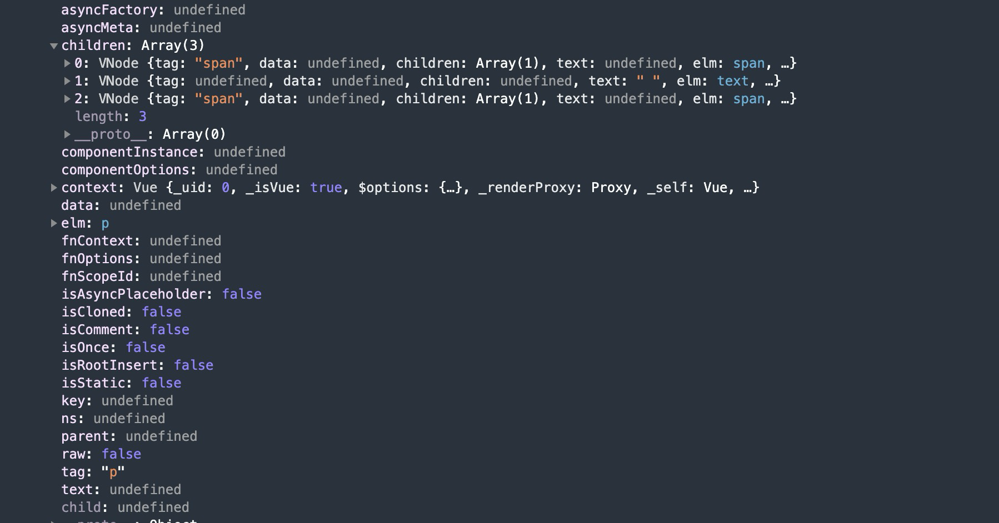

### 1、虚拟DOM简介（vue中的虚拟dom实现）

#### 1.1 什么是虚拟DOM

    虚拟DOM(virtual-dom)只是一个概念，并不是真实的DOM。它是一个用来表示DOM的一种树形结构的对象（本质上就是一个js对象）。

    虚拟DOM是将状态映射成试图的众多解决方案中的一种，它的运作原理是使用状态生成虚拟节点，然后使用虚拟节点渲染试图。

#### 1.2 为什么需要虚拟DOM

    相比于操作DOM对象，处理原生的javascript对象的效率会更高。

    如果有一个渲染对象树（V-DOM）能表示DOM结构，那么每当这个对象发生变化的时候，我们就能使用最新的渲染对象树转化为真正的dom树。从而达到渲染整个视图的目的。

    如果是按照上述说的，直接使用新的渲染对象树进行渲染整个试图的话，那和innerHtml是一样的效果，在渲染之前，会比较更新前的渲染对象树和更新后的渲染对象树的差异，这些差异就是我们需要进行更新的部分试图。这样就达到了，渲染的时候，只需要操作哪些不同部分的DOM结构，从而达到更新整个试图的作用。

    而vue是数据驱动的。所以我们可以总结vue的虚拟DOM以及更新试图的过程

    1、用javascript对象结构表示DOM树的结构，然后用这个树构建一个真正的DOM结构，插到文档中去。
    2、当数据变更后，重新构建一个新的对象树。然后对旧的对象树和新的对象树进行比较。记录两者差异
    3、将旧的对象树更新到新的对象树上（结构一致，不变。增的，在旧的结构添加。删的，在旧的结构进行删除，使得新旧的结构保持一致)

### 2、vue中的VNode实现

#### 2.1、 VNode类

    我们来看看vue中的源码VNode类

```
源码位置：
https://github.com/vuejs/vue/blob/v2.6.0/src/core/vdom/vnode.js

export default class VNode {
  tag: string | void; // 当前节点的标签名（p、div、span等）
  data: VNodeData | void; // 该属性包含了一些节点上的数据（attrs、class、style等）
  children: ?Array<VNode>; // 当前节点的子节点集合（一个数组）
  text: string | void; // 当前节点的文本（文本节点）
  elm: Node | void; // 当前虚拟节点对应的真实dom节点
  ns: string | void; // 
  context: Component | void; // rendered in this component's scope // 它是当前组件的vue实例
  key: string | number | void; // 节点的key属性，用于标记节点，用于优化
  componentOptions: VNodeComponentOptions | void; // 组件节点的options选项参数（propsData、tag和children等信息）
  componentInstance: Component | void; // component instance // 组件实例，也是vue的实例。事实上，每个组件都是一个vue实例。
  parent: VNode | void; // component placeholder node（组件占位符节点） // 组件父节点（后续确定是什么）

  // strictly internal
  raw: boolean; // contains raw HTML? (server only) // 是否是原始Html
  isStatic: boolean; // hoisted static node // 静态节点
  isRootInsert: boolean; // necessary for enter transition check // 
  isComment: boolean; // empty comment placeholder? // 是否为注释节点
  isCloned: boolean; // is a cloned node? // 是否为克隆节点
  isOnce: boolean; // is a v-once node? // 是否有v-once指令节点
  asyncFactory: Function | void; // async component factory function // 异步组件工厂功能
  asyncMeta: Object | void;
  isAsyncPlaceholder: boolean;
  ssrContext: Object | void;
  fnContext: Component | void; // real context vm for functional nodes
  fnOptions: ?ComponentOptions; // for SSR caching
  devtoolsMeta: ?Object; // used to store functional render context for devtools
  fnScopeId: ?string; // functional scope id support

  constructor (
    tag?: string,
    data?: VNodeData,
    children?: ?Array<VNode>,
    text?: string,
    elm?: Node,
    context?: Component,
    componentOptions?: VNodeComponentOptions,
    asyncFactory?: Function
  ) {
    this.tag = tag 
    this.data = data 
    this.children = children 
    this.text = text
    this.elm = elm
    this.ns = undefined
    this.context = context
    this.fnContext = undefined
    this.fnOptions = undefined
    this.fnScopeId = undefined
    this.key = data && data.key
    this.componentOptions = componentOptions
    this.componentInstance = undefined
    this.parent = undefined
    this.raw = false
    this.isStatic = false
    this.isRootInsert = true
    this.isComment = false
    this.isCloned = false
    this.isOnce = false
    this.asyncFactory = asyncFactory
    this.asyncMeta = undefined
    this.isAsyncPlaceholder = false
  }

  // DEPRECATED: alias for componentInstance for backwards compat.
  /* istanbul ignore next */
  get child (): Component | void {
    return this.componentInstance
  }
}


```

### 3、VNode的类型

* 注释类型
* 文本类型
* 元素节点
* 组件节点
* 函数式组件
* 克隆组件
#### 3.1、注释类型
```
// 创建注释节点
export const createEmptyVNode = (text: string = '') => {
  const node = new VNode()
  node.text = text
  node.isComment = true // 是否为注释节点
  return node
}
可以看出来，一个注释节点只有两个有效属性--text和isComment。其他属性都是默认的值

isComment 代表是否为注释节点
text 表示注释文本

例如一个真实的注释节点：

<!-- 我是注释啊 ! -->
其所对应的VNode是这样的
{
  text: '我是注释啊 !',
  isComment: true
}
```
#### 3.2、文本类型
```
// 创建文本节点
export function createTextVNode (val: string | number) {
  return new VNode(undefined, undefined, undefined, String(val))
}
文本类型的VNode被创建时就更简单了。他只有一个text属性
{
  text: '我是注释啊 !'
}
```
#### 3.3、克隆节点
```
// 创建克隆节点
export function cloneVNode (vnode: VNode): VNode {
  const cloned = new VNode(
    vnode.tag,
    vnode.data,
    // #7975
    // clone children array to avoid mutating original in case of cloning
    // a child.
    vnode.children && vnode.children.slice(),
    vnode.text,
    vnode.elm,
    vnode.context,
    vnode.componentOptions,
    vnode.asyncFactory
  )
  cloned.ns = vnode.ns
  cloned.isStatic = vnode.isStatic
  cloned.key = vnode.key
  cloned.isComment = vnode.isComment
  cloned.fnContext = vnode.fnContext
  cloned.fnOptions = vnode.fnOptions
  cloned.fnScopeId = vnode.fnScopeId
  cloned.asyncMeta = vnode.asyncMeta
  cloned.isCloned = true
  return cloned
}

克隆节点是将现有节点复制到新节点去。让新节点创建的节点和克隆节点的属性保持一致，从而实现克隆。

它的作用是优化静态节点和插槽节点（slot node）

克隆节点与被克隆节点的唯一区别在于isCloned属性的值。克隆节点的isCloned=true。被克隆的原始节点isCloned=false
```

#### 3.4、元素节点
```
元素节点通常包括四个属性
tag: 节点名称（p、div、span等）
data: 该属性包含了一些节点上的数据（attrs、class、style等）
children: 当前节点的子节点集合（一个数组）
context: 它是当前组件的vue实例

例如：一个真实的元素节点
<p>
  <span>hello</span>
  <span>vue</span>
</p>

所对应的VNode是如下图
```

#### 3.5、组件节点
```
组件节点和元素节点类似，有以下两个独有的属性
componentOptions: 就是组件节点的选项参数（propsData、tag、children等信息）
componentInstance:组件的实例。也是vue的实例。事实上，每个组件都是一个vue实例。
```

    从上面的源码可以看到。VNode类是一个描述真实DOM节点所需的一系列属性。
    vnode有很多种类型，它们的本质上都是VNode的实例，其唯一区别只是属性不同。

https://github.com/livoras/blog/issues/13