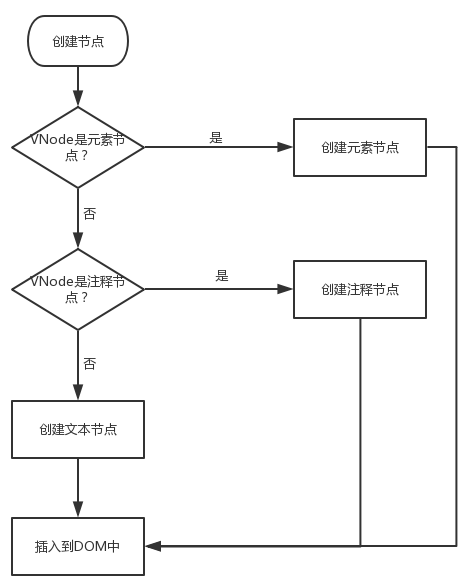

虚拟DOM的核心部分是patch,它可以将vnode渲染成真实的dom

patch（补丁）的过程实质上是指：以新的VNode为基准，改造旧的oldVNode使之与新的VNode相同，这就是patch的过程。

实际上，patch的过程主要是做三件事：

* 1、创建节点：

    * 新的VNode中有而旧的VNode没有，就在旧的VNode创建不存在的节点

* 2、删除节点：

    * 新的VNode中没有，而旧的VNode有这个节点，则在旧的oldVNode上删除这个节点

* 3、更新节点

    * 新的VNode和旧的oldVNode中都有，就以新的VNode为准，更新旧的oldVNode。

### 2、创建节点

    我们直接看源码部分。
```
function isDef (v) {
    return v !== undefined && v !== null
}
function isTrue (v) {
    return v === true
}
function createElm (
    vnode,
    insertedVnodeQueue,
    parentElm,
    refElm,
) {
    const data = vnode.data
    const children = vnode.children
    const tag = vnode.tag
    if (isDef(tag)) { // 判断当前节点的标签名不为空
        vnode.elm = nodeOps.createElement(tag, vnode) // 创建元素节点
        createChildren(vnode, children, insertedVnodeQueue) // 创建元素节点的子节点
        insert(parentElm, vnode.elm, refElm) // 插入节点中
    } else if (isTrue(vnode.isComment)) { // 是否为注释节点
        vnode.elm = nodeOps.createComment(vnode.text) // 创建注释节点
        insert(parentElm, vnode.elm, refElm)
    } else { // 
        vnode.elm = nodeOps.createTextNode(vnode.text) // 创建文本节点
        insert(parentElm, vnode.elm, refElm)
    }
}

function createChildren (vnode, children, insertedVnodeQueue) {
      if (Array.isArray(children)) {
        {
          checkDuplicateKeys(children);
        }
        for (var i = 0; i < children.length; ++i) {
          createElm(children[i], insertedVnodeQueue, vnode.elm, null, true, children, i); // 这里递归创建子节点
        }
      } else if (isPrimitive(vnode.text)) {
        nodeOps.appendChild(vnode.elm, nodeOps.createTextNode(String(vnode.text)));
      }
    }
```

从上方的代码，我们可以清晰的看出。

* 需要判断当前的tag是否存在tag标签。如果存在标签。则调用createElement创建元素节点，然后再递归创建子节点。创建好所有的子节点之后，插入DOM中

* 如果不存在tag标签。则判断当前节点是否为注释节点.只需要判断VNode中的isComment属性是否为true就行.如果为true,则表示该节点为注释节点.

* 如果既不是元素节点,也不是注释节点,那就被认为是文本节点,则调用createTextNode方法来创建文本节点,再插入到DOM中.


### 3、删除节点
```
function parentNode (node) {
    return node.parentNode
}
function removeNode (el) {
    const parent = nodeOps.parentNode(el) // 获取父节点
    // element may have already been removed due to v-html / v-text 元素可能由于v-html/v-text而被删除
    if (isDef(parent)) { // 存在
      nodeOps.removeChild(parent, el) 删除
    }
  }
```

    如果在新的VNode节点没有,而在旧的oldVNode中有,那么就需要把这些节点从旧的oldVNode删除.删除很简单.获取到父节点之后,调用父节点的removeChild方法即可.

### 4、更新节点

    创建节点和删除节点比较简单。更新节点相比来说，可能会更复杂一点，但是只要理清楚，还是比较容易理解的

    更新节点其实也就是：某些节点在oldVnode和新的VNode中都存在，我们需要比较一下，找出不一样的地方进行更新，使得新旧VNode保持一致。

    在了解更新节点的实现机制之前。我们需要先了解一个概念，就是在创建VNode的时候，在入参有一个isStatic的属性：这个属性表示该VNode是否一个静态节点（在该节点上，没有任何变量，只有单纯的文字，这个节点只需要第一次渲染一次就好，渲染之后就再也不会发生变化。这样的节点，我们称为静态节点。）


    了解静态节点之后，我们来介绍vue中是如何更新节点的。（直接上源码。跟随源码来了解实现）

```
function isUndef (v) {
    return v === undefined || v === null
}
function setTextContent (node, text) {
    node.textContent = text;
}
function patchVnode (
    oldVnode,
    vnode,
    insertedVnodeQueue,
    ownerArray,
    index,
    removeOnly
  ) {
    // 判断新旧VNode是否一致，如果一致，退出当前程序  
    if (oldVnode === vnode) {
      return
    }
    const elm = vnode.elm = oldVnode.elm

    // reuse element for static trees. 重用静态节点元素
    // note we only do this if the vnode is cloned - // 注意：只有在是克隆节点时，我们才这样做
    // if the new node is not cloned it means the render functions have been
    // 如果这个节点未被克隆，则代表已经渲染
    // reset by the hot-reload-api and we need to do a proper re-render.
    // 通过hot-reload-api进行重置，我们需要进行适当的重新渲染。

    // 新旧的VNode是否都是静态节点。&&
    // 新旧的VNode的key属性是否一致
    // VNode是否是克隆节点 || vnode是否有v-once指令节点
    if (isTrue(vnode.isStatic) &&
      isTrue(oldVnode.isStatic) &&
      vnode.key === oldVnode.key &&
      (isTrue(vnode.isCloned) || isTrue(vnode.isOnce))
    ) {
      vnode.componentInstance = oldVnode.componentInstance
      return
    }

    const data = vnode.data
    const oldCh = oldVnode.children
    const ch = vnode.children

    // vnode上有text属性？ 
    if (isUndef(vnode.text)) {
      // vnode没有text属性。
      // oldVnode上存在children属性 && Vnode上也存在children属性
      if (isDef(oldCh) && isDef(ch)) {
        // 如果   oldVnode上的children属性 和 Vnode上的children属性 不相等，则更新子节点updateChildren
        if (oldCh !== ch) updateChildren(elm, oldCh, ch, insertedVnodeQueue, removeOnly)
      } else if (isDef(ch)) { // 如果只有vnode上有children属性
        // oldVnode上存在text属性（有文本）。清空文本
        if (isDef(oldVnode.text)) nodeOps.setTextContent(elm, '')
        // 创建子节点，并VNode的子节点添加到DOM中
        addVnodes(elm, null, ch, 0, ch.length - 1, insertedVnodeQueue)
      } else if (isDef(oldCh)) {  // 如果只有oldVnode上有children属性
        // 删除子节点
        removeVnodes(elm, oldCh, 0, oldCh.length - 1) 
      } else if (isDef(oldVnode.text)) {
        // 都没有子节点。 但是oldVnode上存在text属性（有文本）。清空文本
        nodeOps.setTextContent(elm, '')
      }
    } else if (oldVnode.text !== vnode.text) { // oldVnode和VNode的text属性（文本内容） 是否相同
      nodeOps.setTextContent(elm, vnode.text) //不相同：则用vnode的text替换真实DOM的文本
    }
  }
  // nodeOps是节点操作，定义各种原生dom基础操作方法。
  // modules 是属性操作，定义属性更新实现。
```

