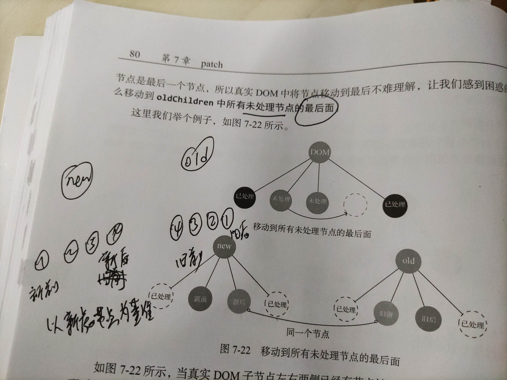

在上一节我们说了。更新子节点的提前。

```
// 如果   oldVnode上的children属性 和 Vnode上的children属性 不相等（新旧子节点的VNode是否相同），则更新子节点updateChildren
if (oldCh !== ch) updateChildren(elm, oldCh, ch, insertedVnodeQueue, removeOnly)
```
### 更新策略

  主要针对新增节点、更新节点、移动节点、删除节点进行（通过循环新旧节点来比较的）

  * 创建子节点

      如果在newChildren里面的某个节点在循环结束后依旧在oldChildren中找不到相同的节点，那么说明newChildren中的该节点是一个新增节点。 对于新增节点。我们需要执行创建节点的操作（addVnodes方法）。并将新创建的节点插入到oldChildren中所有未处理的节点之前。（为什么要插入到未处理的节点之前）

  * 更新子节点

      当一个节点同时存在于newChildren和oldChildren中，并且位置相同，这种情况只需要进行更新节点的操作就行（updateChildren方法）。
      如果位置不相同，除了对真实DOM进行更新之外，还需要对这个真实DOM节点进行移动节点的操作

  * 移动节点

      移动节点，顾名思义就是说，当一个节点在同时存在于newChildren和oldChildren中，但位置不同，这个时候需要将这个节点以新的VNode的位置为基准进行移动（nodeOps.insertBefore方法）。（只需要将需要移动的节点移动到所有未处理节点的最前面，就能实现。Node.insertBefore()方法即可）

  * 删除节点

    删除子节点。本质上就是删除那些oldChildren中存在，newChildren中不存在的节点。
    当newChildren中的所有节点都循环一遍之后，也就是循环结束之后，如果oldChildren中还有剩余的没有被处理的节点，那么这些节点就是需要删除的节点（removeVnodes方法）。（源码中的removeVnodes(parentElm, oldCh, oldStartIdx, oldEndIdx)）

那么我们来看下源码中的updateChildren的方法

```
function updateChildren (parentElm, oldCh, newCh, insertedVnodeQueue, removeOnly) {
    let oldStartIdx = 0 // 旧的开始位置索引
    let newStartIdx = 0 // 新的开始位置索引
    let oldEndIdx = oldCh.length - 1 // 旧的结束位置索引
    let oldStartVnode = oldCh[0] // 旧的第一个Vnode
    let oldEndVnode = oldCh[oldEndIdx] // 旧的最后一个Vnode
    let newEndIdx = newCh.length - 1 // 新的结束位置索引
    let newStartVnode = newCh[0] // 新的第一个Vnode
    let newEndVnode = newCh[newEndIdx] // 新的最后一个Vnode
    let oldKeyToIdx, idxInOld, vnodeToMove, refElm

    // removeOnly is a special flag used only by <transition-group>
    // to ensure removed elements stay in correct relative positions
    // during leaving transitions
    const canMove = !removeOnly

    while (oldStartIdx <= oldEndIdx && newStartIdx <= newEndIdx) {
      if (isUndef(oldStartVnode)) {
        oldStartVnode = oldCh[++oldStartIdx] // Vnode has been moved left
      } else if (isUndef(oldEndVnode)) {
        oldEndVnode = oldCh[--oldEndIdx]
      } else if (sameVnode(oldStartVnode, newStartVnode)) { // 旧前和新前
        patchVnode(oldStartVnode, newStartVnode, insertedVnodeQueue, newCh, newStartIdx)
        oldStartVnode = oldCh[++oldStartIdx]
        newStartVnode = newCh[++newStartIdx]
      } else if (sameVnode(oldEndVnode, newEndVnode)) { // 旧后和新后
        patchVnode(oldEndVnode, newEndVnode, insertedVnodeQueue, newCh, newEndIdx)
        oldEndVnode = oldCh[--oldEndIdx]
        newEndVnode = newCh[--newEndIdx]
      } else if (sameVnode(oldStartVnode, newEndVnode)) { // 旧前和新后（除了更新节点外还需要移动节点） // Vnode moved right
        // 更新节点
        patchVnode(oldStartVnode, newEndVnode, insertedVnodeQueue, newCh, newEndIdx)
        // 移动节点。（将节点移动到oldChildren中所有未处理的节点后面）
        canMove && nodeOps.insertBefore(parentElm, oldStartVnode.elm, nodeOps.nextSibling(oldEndVnode.elm))
        oldStartVnode = oldCh[++oldStartIdx]
        newEndVnode = newCh[--newEndIdx]
      } else if (sameVnode(oldEndVnode, newStartVnode)) { // Vnode moved left
        patchVnode(oldEndVnode, newStartVnode, insertedVnodeQueue, newCh, newStartIdx)
        canMove && nodeOps.insertBefore(parentElm, oldEndVnode.elm, oldStartVnode.elm)
        oldEndVnode = oldCh[--oldEndIdx]
        newStartVnode = newCh[++newStartIdx]
      } else {
        if (isUndef(oldKeyToIdx)) oldKeyToIdx = createKeyToOldIdx(oldCh, oldStartIdx, oldEndIdx)
        idxInOld = isDef(newStartVnode.key)
          ? oldKeyToIdx[newStartVnode.key]
          : findIdxInOld(newStartVnode, oldCh, oldStartIdx, oldEndIdx)
        if (isUndef(idxInOld)) { // New element
          createElm(newStartVnode, insertedVnodeQueue, parentElm, oldStartVnode.elm, false, newCh, newStartIdx)
        } else {
          vnodeToMove = oldCh[idxInOld]
          if (sameVnode(vnodeToMove, newStartVnode)) {
            patchVnode(vnodeToMove, newStartVnode, insertedVnodeQueue, newCh, newStartIdx)
            oldCh[idxInOld] = undefined
            canMove && nodeOps.insertBefore(parentElm, vnodeToMove.elm, oldStartVnode.elm)
          } else {
            // same key but different element. treat as new element
            createElm(newStartVnode, insertedVnodeQueue, parentElm, oldStartVnode.elm, false, newCh, newStartIdx)
          }
        }
        newStartVnode = newCh[++newStartIdx]
      }
    }
    if (oldStartIdx > oldEndIdx) {
      refElm = isUndef(newCh[newEndIdx + 1]) ? null : newCh[newEndIdx + 1].elm
      addVnodes(parentElm, refElm, newCh, newStartIdx, newEndIdx, insertedVnodeQueue)
    } else if (newStartIdx > newEndIdx) {
      removeVnodes(parentElm, oldCh, oldStartIdx, oldEndIdx)
    }
  }

```

### 优化策略

回想之前的，我们了解到的，vue中patch是通过VNode和oldVNold进行比较来进行判断是执行操作的（更新、删除、创建）。对比的话，最简单的方法就是两层循环分别循环新旧节点。

但是当VNode和oldVNode的子节点非常多的时候，双层循环的时间复杂度是n的平方，性能可以说是非常差的。

并且并不是所有的新老VNode都会进行变化。只是其中的某些部分会进行变化，那么我们可以通过一些方法来进行优化。

从上方的vue源码updateChildren中我们可以看出。vue中是根据对比新旧子节点的第一个位置和最后一个位置的节点是否相同来优化的。

```
    let oldStartVnode = oldCh[0] // 旧的第一个Vnode(下方称之为旧前)
    let oldEndVnode = oldCh[oldEndIdx] // 旧的最后一个Vnode(下方称之为旧后)
    let newStartVnode = newCh[0] // 新的第一个Vnode(下方称之为新前)
    let newEndVnode = newCh[newEndIdx] // 新的最后一个Vnode(下方称之为新后)
```
1、旧前和新前一致
```
if(sameVnode(oldStartVnode, newStartVnode)) {
  patchVnode(oldStartVnode, newStartVnode, insertedVnodeQueue, newCh, newStartIdx)
  oldStartVnode = oldCh[++oldStartIdx]
  newStartVnode = newCh[++newStartIdx]
}
```
当旧前和新前的vnode是一致的时候，只需要进行更新节点的操作即可。并且从新定义旧前和新前（初始索引+1，从oldCh和newCh重新获取。）。

2、旧后和新后
```
if (sameVnode(oldEndVnode, newEndVnode)) { // 旧后和新后
  patchVnode(oldEndVnode, newEndVnode, insertedVnodeQueue, newCh, newEndIdx)
  oldEndVnode = oldCh[--oldEndIdx]
  newEndVnode = newCh[--newEndIdx]
} 
```
旧后和新后一致的时候，和第一个旧前和新前非常类型。都是直接更新节点旧可以。并且从新定义旧前和新前（末尾索引-1，从oldCh和newCh重新获取。）

3、旧前和新后（除了更新节点外还需要移动节点）
```
if (sameVnode(oldStartVnode, newEndVnode)) { // 旧前和新后（除了更新节点外还需要移动节点） // Vnode moved right
  // 更新节点
  patchVnode(oldStartVnode, newEndVnode, insertedVnodeQueue, newCh, newEndIdx)
  // 移动节点。（将节点移动到oldChildren中所有未处理的节点之前）
  canMove && nodeOps.insertBefore(parentElm, oldStartVnode.elm, nodeOps.nextSibling(oldEndVnode.elm))
  oldStartVnode = oldCh[++oldStartIdx]
  newEndVnode = newCh[--newEndIdx]
}
```
从代码中我们可以知道。除了需要更新节点之外，还需要移动对应的DOM节点。移动到哪呢？我们可以看到源码中是将dom移动到nodeOps.nextSibling(oldEndVnode.elm)的前面，
实际上 parentElm.insertBefore(oldStartVnode.elm(插入的节点), oldEndVnode.elm.nextSibling(插在这个节点之前， 为 null 则 newNode 将被插入到子节点的末尾))。而oldEndVnode是旧的虚拟节点中的最后一个节点（这个最后一个节点是动态，指的是未处理的最后一个）。所以我们可以知道，最终会插入到oldChildren中所有未处理的节点的最后面。

new中的4放入old的1后面

4、旧后和新前（除了更新节点外还需要移动节点）
```
if (sameVnode(oldEndVnode, newStartVnode)) { // Vnode moved left
  patchVnode(oldEndVnode, newStartVnode, insertedVnodeQueue, newCh, newStartIdx)
  canMove && nodeOps.insertBefore(parentElm, oldEndVnode.elm, oldStartVnode.elm)
  oldEndVnode = oldCh[--oldEndIdx]
  newStartVnode = newCh[++newStartIdx]
} 
```
和第三个类似。只不过在更新之后，需要将当前节点（oldEndVnode.elm）插入到oldStartVnode.elm（所有未处理的节点）的前面

如上图的new的1节点和old的1节点。

**因为都是更新节点是基于新虚拟节点未基准。**所以更新后的dom中，1是位于最左侧的，因此应该将1插入到**未处理的节点的最前面（old的4前面）**