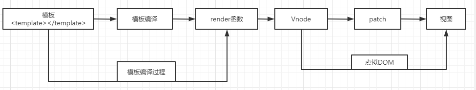
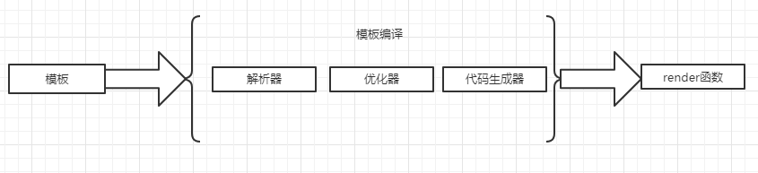

之前，介绍过虚拟DOM,其中大部分都是关于虚拟DOM拿到vnode所做的事，而模版编译所介绍的内容是如何让虚拟DOM拿到vnode.

### 什么是模板编译

vue是基于html的模板语法，在日常开发中，我们经常使用<template></template>标签中写入类似原生html的内容，这部分称之为模板。
而模板编译则是将<template></template>标签中类似html的内容编译，生成渲染函数，这一过程被称之为模板编译过程。



### 将模版编译成渲染函数

将模版编译成渲染函数可以分两个步骤，先将模版解析成AST(抽象语法树)，然后再使用AST生成渲染函数。

但是因为静态节点不需要总是重新渲染，所以在生成AST之后，生成渲染函数之前，需要遍历一遍AST,给所有的静态节点做一个标记。这样在虚拟DOM中更新节点时，如果发现是节点有静态节点这个标记，则不去重新渲染它。

所以：编译模版可以分为三部分内容

* 将模版解析成AST
* 遍历AST标记静态节点
* 使用AST生成渲染函数

这三个部分内容在模版编译中分别抽象出三个模块来实现。分别是

* 解析器
* 优化器
* 代码生成器



#### 解析器（将模板解析成AST）

在模板解析阶段，主要是将模板使用正则等方式解析成抽象语法树（AST）。而这个阶段在源码中对应着是parse方法（源码如下）

```
   /**
   * Convert HTML string to AST(将HTML字符串转换为AST).
   * params template: 模板字符串
   * params options 模板内参数
   */
  function parse (
    template,
    options
  ) {
      let stack = [] // 维护一个栈
      parseHTML(template, {

          // 当解析到开始标签时，调用该函数
          // tag：标签模
          // attrs: 标签属性
          // unary: 是否是自闭和标签
          start(tag, attrs, unary, start$1) {
            function createASTElement (
                tag,
                attrs,
                parent
            ) {
                return {
                    type: 1,
                    tag: tag,
                    attrsList: attrs,
                    attrsMap: makeAttrsMap(attrs),
                    rawAttrsMap: {},
                    parent: parent,
                    children: []
                }
            }
            var element = createASTElement(tag, attrs, currentParent); // 创建一个元素类型的AST节点
            stack.push(element); // 当是开始标签的时候，将这个节点推入栈中
          },
          // 当解析到结束标签时，调用该函数
          end() {
            var element = stack[stack.length - 1];
            // pop stack
            stack.length -= 1;
            currentParent = stack[stack.length - 1];
            closeElement(element);
          },
          // 当解析到文本时，调用该函数
          chars() {
              
            function parseText () {
                var tagRE = /\{\{((?:.|\r?\n)+?)\}\}/g; // {{}}匹配是否有这个的正则
                if (!tagRE.test(text)) {
                    return
                }
            }
            if (text !== ' ' && (res = parseText(text, delimiters))) { // 当有变量的时候
                child = {
                    type: 2,
                    expression: res.expression,
                    tokens: res.tokens,
                    text: text
                };
            } else if (text !== ' ' || !children.length || children[children.length - 1].text !== ' ') {  // 当没有变量的时候
                child = {
                    type: 3,
                    text: text
                };
            }
          },
          // 当解析到注释时，调用该函数
          comment(text, start, end) {
            var child = {
                type: 3,
                text: text,
                isComment: true
            };
          }
      })
  }
```

我们先说下整体的大致流程：
* 1、解析模板(parse方法)

    parse方式是解析器的主函数。在其内部调用parseHTML来解析对应的模板，在解析过程，如果遇到文本信息，就会调用文本解析器parseText函数进行文本解析；如果文本中含有过滤器，就会调用parseFilters方法进行解析
```
function parseHTML (html, options) {
    var expectHTML = options.expectHTML;
    var isUnaryTag$$1 = options.isUnaryTag || no;
    var canBeLeftOpenTag$$1 = options.canBeLeftOpenTag || no;
    var index = 0;
    var last, lastTag;
    while (html) {
      last = html;
      if (!lastTag || !isPlainTextElement(lastTag)) {
        var textEnd = html.indexOf('<');
        if (textEnd === 0) {
          // Comment = /^<!\--/
          // 是否是注释: 例如<!-- 我是注释 -->
          if (comment.test(html)) {
            var commentEnd = html.indexOf('-->');

            if (commentEnd >= 0) {
              if (options.shouldKeepComment) {
                options.comment(html.substring(4, commentEnd), index, index + commentEnd + 3);
              }
              advance(commentEnd + 3);
              continue
            }
          }
          // conditionalComment = /^<!\[/ 
          // 是否是条件注释开头的：例如<![if !IE]><link href="non-ie.css" rel="stylesheet"><![endif]>
          if (conditionalComment.test(html)) {
            var conditionalEnd = html.indexOf(']>');

            if (conditionalEnd >= 0) {
              advance(conditionalEnd + 2);
              continue
            }
          }

          // doctype = /^<!DOCTYPE [^>]+>/i
          // 是否是文档节点：<!DOCTYPE html>
          var doctypeMatch = html.match(doctype);
          if (doctypeMatch) {
            advance(doctypeMatch[0].length);
            continue
          }

          // var ncname = "[a-zA-Z_][\\-\\.0-9_a-zA-Z" + unicodeLetters + "]*";
          // var qnameCapture = "((?:" + ncname + "\\:)?" + ncname + ")";
          // var endTag = new RegExp(("^<\\/" + qnameCapture + "[^>]*>"));
          
          // 是否是结束标签：例如：</div>
          var endTagMatch = html.match(endTag);
          if (endTagMatch) {
            var curIndex = index;
            advance(endTagMatch[0].length);
            parseEndTag(endTagMatch[1], curIndex, index);
            continue
          }

          // 是否是开始标签：例如：<div>
          var startTagMatch = parseStartTag();
          if (startTagMatch) {
            handleStartTag(startTagMatch);
            continue
          }
        }
      }
    }

    function advance (n) {
      index += n;
      html = html.substring(n);
    }

  }
  function parseStartTag () {
      var start = html.match(startTagOpen);
      if (start) {
        var match = {
          tagName: start[1],
          attrs: [],
          start: index
        };
        advance(start[0].length);
        var end, attr;
        while (!(end = html.match(startTagClose)) && (attr = html.match(dynamicArgAttribute) || html.match(attribute))) {
          attr.start = index;
          advance(attr[0].length);
          attr.end = index;
          match.attrs.push(attr);
        }
        if (end) {
          match.unarySlash = end[1];
          advance(end[0].length);
          match.end = index;
          return match
        }
      }
    }
    function advance (n) {
      index += n;
      html = html.substring(n);
    }
```
* 2、解析html(parseHTML方法)
    
    解析html（模板字符串）的方式，是从左往右逐个解析。最终解析成AST。我们知道DOM树型结构是有父子关系的。但是再vue中解析结果的AST是一个平级的，没有层级关系。
    在vue中，每创建一个AST节点(createASTElement)就会向栈（stack）中增加这个AST节点，达到平级的关系

    在解析html的过程，我们可能需要解析的种类有
    
        * 注释（例如：<!-- 我是注释 -->）
        * 条件注释（例如：<![if !IE]><link href="non-ie.css" rel="stylesheet"><![endif]>）
        * doctype标签（例如：<!DOCTYPE html>）
        * 开始标签（例如：<div>）
        * 结束标签（例如：</div>）
    除了开始标签，其余的解析都比较简单，这边就重点介绍下开始标签。其余可以直接看上述源码
    
    截取开始标签方法：
```
  var unicodeLetters = 'a-zA-Z\u00B7\u00C0-\u00D6\u00D8-\u00F6\u00F8-\u037D\u037F-\u1FFF\u200C-\u200D\u203F-\u2040\u2070-\u218F\u2C00-\u2FEF\u3001-\uD7FF\uF900-\uFDCF\uFDF0-\uFFFD'; 
  var ncname = "[a-zA-Z_][\\-\\.0-9_a-zA-Z" + unicodeLetters + "]*";
  var qnameCapture = "((?:" + ncname + "\\:)?" + ncname + ")";
  var startTagOpen = new RegExp(("^<" + qnameCapture));
  '<div>111</div>'.match(startTagOpen) //  ["<div", "div", index: 0, input: "<div>1111</div>", groups: undefined]
```
    在parseStartTag方法中，先会对需要解析的模板字符串匹配是否有开始标签。如果有，则将原模板字符串进行截取，赋值给原的模板字符串变量html.可以得到该标签名称
    再循环新的模板字符串(接去掉匹配的开始标签部分，上述例子的"<div"部分)。

```
// 对应截取的方法
html = '<div>111</div>'
var start = html.match(startTagOpen);
advance(start[0].length);
function advance (n) {
  index += n;
  html = html.substring(n);
}
```

    截取之后的字符串再进行循环。判断是否是开始标签的闭合标签还是属性

```
var startTagClose = /^\s*(\/?)>/; // 匹配开始标签的闭合标签。例如：<div>开始标签中的'>'这部分

var attribute = /^\s*([^\s"'<>\/=]+)(?:\s*(=)\s*(?:"([^"]*)"+|'([^']*)'+|([^\s"'=<div>`]+)))?/; // 匹配开始开始标签内的属性
var end, attr;
while (!(end = html.match(startTagClose)) && attr = html.match(attribute)) { // 循环匹配模板字符串 不是开始标签的闭合标签 && 存在属性
  // 解析
  attr.start = index;
  advance(attr[0].length);
  attr.end = index;
  match.attrs.push(attr);
}
// '<div class="id" id="class">sss</div>'
// 上方循环是： 在<div 后 一直匹配属性attr.
// 当所有属性匹配完之后
// 如果是非自闭和标签：剩下'>sss</div>'
// 如果是自闭和标签：剩下'/>'

// 如果是自闭和标签： end = '/>'.match(startTagClose) 得到的结果为 ["/>", "/", index: 0, input: "/>", groups: undefined]
// 如果是非自闭和标签： end = '>sss</div>'.match(startTagClose) 得到的结果为 [">", "", index: 0, input: ">sss</div>", groups: undefined]

// 从上面的结果我们知道，可以使用end[1]来判断是否是自闭和标签。
if (end) {
  match.unarySlash = end[1];
  advance(end[0].length);
  match.end = index;
  return match
}
```

    整个截取开始标签是调用parseStartTag。这个方法来判断是有开始标签，如果有的话，返回match。 如果不存在，则返回undefined。
    
