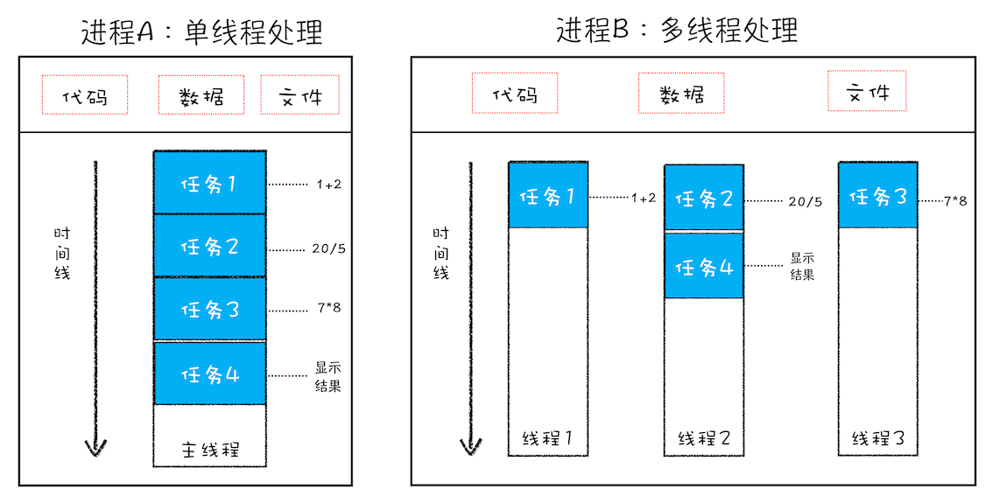

### 线程和进程

多线程可以并行处理任务，但是**线程是不能单独存在的**，它是由**进程来启动或管理**的。

**一个进程就是一个程序的运行实例**。详细解释就是：启动一个程序，操作系统会为该程序创建一块内存，用来存放代码、运行中的数据和执行任务的主线程，我们把这样的一个运行环境叫做**进行**

从上图知道，线程是依附于进程的，而进程中使用多线程并行处理能提升运算效率。

总结来说:进程和线程之间的关系有四个特点。

1. 进程中任一线程执行出错，都会导致整个进程的奔溃
2. 线程之间共享进程中的数据
3. 当一个进程关闭后，操作系统会回收进程所占用的内存。
4. 进程之间的内容相互隔离。

### 单进程的浏览器时代

单进程浏览器指的是浏览器所有的功能模块都是运行在同一个进程当中。这些模块保活。网络、插件、javascript的运行环境、渲染引擎和页面等。

单线程浏览器的缺点：不稳定、不流畅、不安全

不稳定：插件（web视频、web游戏）和渲染引擎模块（复杂的js代码）的易崩溃性。导致整个浏览器的崩溃。

不流畅：递归和内存泄漏是单进程变慢的一个重要原因。通常浏览器的内核都是非常复杂的，运行一个复杂点的页面再关闭页面，会存在内存不能完全回收的情况，这样导致的问题是使用时间越长，内存占用越高，浏览器会变得越慢。

不安全： 

### 多进程浏览器时代

最新的chrome浏览器包括：1个浏览器主进程、1个GPU进程、1个网络进程、多个渲染进程和多个插件进程

* **浏览器进程**：主要负责界面显示、用户交互、子进程管理、同时还提供存储功能

* **渲染进程**： 核心任务是将 HTML、CSS 和 JavaScript 转换为用户可以与之交互的网页，排版引擎 Blink 和 JavaScript 引擎 V8 都是运行在该进程中，默认情况下，Chrome 会为每个 Tab 标签创建一个渲染进程。

* **GPU进程**：一开始。chrome没有GPU进程，而GPU只是用来处理3D Css的效果，随后网页、chrome的ui界面都采用GPU来绘制，这让GPU称为浏览器普遍的需求，最后，chrome将GPU进程也添加进去了

* **网络进程**：主要负责页面的网络资源加载。
* **插件进程**：主要是负责插件的运行，因插件易崩溃，所以需要通过插件进程来隔离，以保证插件进程崩溃不会对浏览器和页面造成影响。

这也是为什么打开一个chrome页面，至少会有四个进程（浏览器进程、渲染进程、GPU进程、网络进程）

