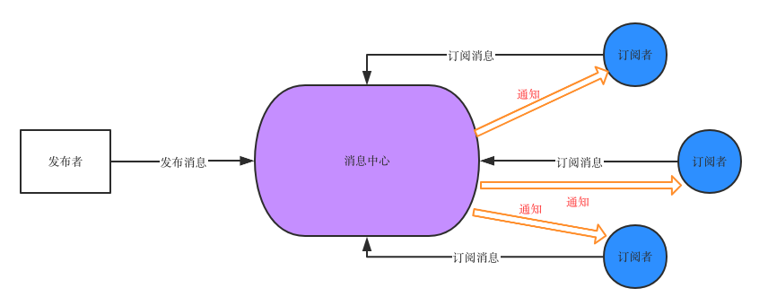

    class myEventEmitter{
        constructor() {
            this.eventMap = {}
        }
        // type 事件名称
        on (type,handler) {
            // handler必须是一个函数
            if(typeof handler !== 'function') {
                throw new Error('error, handler must is function')
            }
            if(!this.eventMap[type]) {
                this.eventMap[type] = []
            }
            this.eventMap[type].push(handler)
        }
        emit(type, params) {
            if(this.eventMap[type]) {
                this.eventMap[type].forEach((item, index) => {
                    item(params)
                })
            }
        }
        off(type, handler){
            if(this.eventMap[type]) {
                let index = this.eventMap[type].indexOf(handler)
                index > 0 && this.eventMap[type].splice(index, 1)
            }
        }
    }

// 实例化 myEventEmitter

const myEvent = new myEventEmitter();

// 编写一个简单的 handler

const testHandler = function (params) {

console.log(`test事件被触发了，testHandler 接收到的入参是${params}`);

};

// 监听 test 事件

myEvent.on("test", testHandler);

// 在触发 test 事件的同时，传入希望 testHandler 感知的参数

myEvent.emit("test", "newState");
