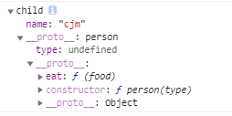
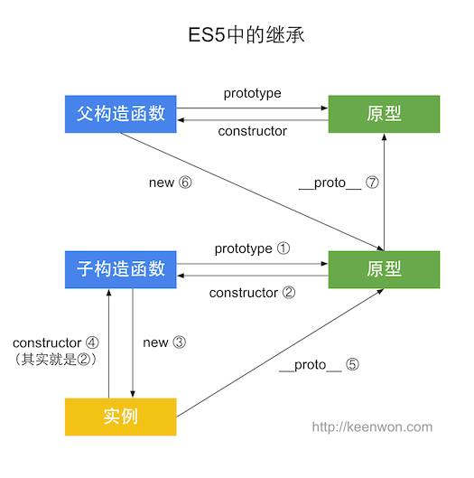
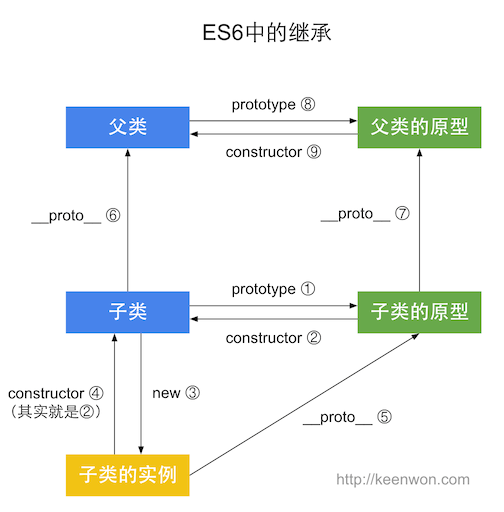

1、js数据类型
------------------------------
数据类型分为：基本数据类型和引用数据类型

基本数据类型有：number、string、boolean、undefined、null、Symbol

undefined 和 null的区别； undefined是声明未赋值
null表示值赋值为 null

引用数据类型：Object

区别：

1、基本数据类型存储在栈内存中。数据大小确定、内存空间大小可以分配。因为他们是按值存储的，所以可以直接按值访问
    
引用数据类型存储在堆内存中。变量是存储在栈内存中的一个指针（保存的是堆内存中的引用地址），这个指针指向堆内存

1、声明时内存分配不同。

    基本数据类型存储在栈中；引用的值存储在堆中，引用的变量存储在栈中，而引用的变量只用来查找堆中的引用地址

2、不同的内存分配带来不同的访问机制；

    javascrip中不允许直接访问保存在堆内存中的对象，需要访问栈中存储引用类型的变量所对应的堆中的引用地址，从而通过这个引用地址去获取这个对象，这就是按引用访问。

    原始类型是可以直接访问的。
3、复制变量时的不同。

    原始类型，会在内存中开辟一个新的栈空间给新的值。

    引用类型：会将引用类型的变量（存储在栈中，与原始类型一致）[这个变量也就是堆内存的一个地址]赋值给新的变量。赋值后的变量和原变量，存储的是同一个堆中的引用。
4、参数传递的不同（把实参复制给形参的过程）

    ECMAScript中的所有函数都是按值来传递的。

    由第三点可以知道，传入引用类型时，其实传的是引用类型的变量所对应的堆内存中的地址，所有函数内部对引用类型的值做改变时会体现到外部的原因。

堆栈的区别：

判断类型的方法由哪些？

tyoeof: 返回一个字符串(判断原始数据类型)

    typeof NaN 返回 'number'
    typeof undefined 返回'undefined'
    typeof null 返回'object'
    typeof function 返回 'function'
    var a = Symbol(1)
    typeof a  返回 'symbol'
    typeof Symbol 返回'function'

instanceof运算符（判断引用数据类型）

    用来检测构造函数的prototype属性是否出现在某个实例对象的原型链上。
    var a = []
    a instanceof Array 返回true
    a instanceof Object 返回true

    可以知道Array继承了object的方法
    也就是说
    Array.__proto__.__proto__ === Object.prototype
    Array.prototype.__proto__ === Object.prototype

Array.prototype.toString.call() 和
Object.prototype.toString.call() 

    能准确的判断是何种类型

继承的五种方法

    <!-- 父类 -->
    function person (type) {
        this.type = type
        this.link = ['game', 'play']
    }
    person.prototype.eat=function(food){
        console.log(this.name+" is eating "+food);
    }
    <!-- 子类 -->
    function child (name) {
        this.name=name
    }
    // 如何让子类的child继承父类？

1、 构造函数继承

    // 这种方法最简单，直接利用call和apply方法将父类构造函数的this绑定为子类当中
    function child (name) {
        person.call(this, name)
        this.name = name
    }
    var cjm = new child('cjm')
    console.dir(cjm) 
    // 可以看到结果 {name: 'cjm', type: 'cjm'}。不能继承父类原型对象上的方法

    // 构造函数继承：只能继承父类构造函数中的属性和方法，不能继承父类原型上的方法

2、原型继承（最常见）

    child.prototype = new person()
    var cjm = new child('cjm')
    console.dir(cjm)
    

    原型继承：缺点。因为子类继承了父类person实例对象 
    这会导致子类的每个实例，都享用原型对象的对象和方法。
    比如link。
    cjm.link.push('wly')
    var cjm1 = new child('cjm1')
    console.log(cjm1.link) // ['game', 'play', 'wly']
    cjm.link === cjm1.link

3、组合继承（利用原型继承和构造函数继承的优势组合使用）

    function child(name) {
        person.call(this, name)
    }

    child.prototype = new person()

    var cjm = new child('cjm')
    cjm.link.push('wly')
    
    var cjm1 = new child('cjm1')

    可以看到cjm和cjm1内的link值互不影响。

    // 缺点是无论如何。每次都会调用两次父类的构造函数。
    // 一次在创建子类的原型的时候，一次在子类构造函数内部

4、寄生继承

    function fun(obj) {
        function Son(){}
        // 原型继承
        Son.prototype = obj
        return new Son()
    }
    function Jisheng (obj) {
        var clone = fun(obj)
        clone.say = function(){
            console.log('我是say方法');
        }
        return clone
    }
    var parentObj = {
        name: 'cjm'
    }
    var cjm = new Jisheng(parentObj)
    var cjm1 = new Jisheng(parentObj)
    console.log(cjm.say === cjm1.say) // false

5、寄生组合继承（利用组合继承和寄生继承各自优势）

    function Jisheng(son,parent){
        var clone = Object.create(parent.prototype)
        son.prototype = clone
        clone.constructor = son;
        //相当于 son.prototype.constructor = son
    }
    function person (type) {
        this.type = type
        this.link = ['game', 'play']
    }
    person.prototype.eat=function(food){
        console.log(this.type+" is eating "+food);
    }
    function Son(name){
        parent.call(this,name);
    }
    new Jisheng(Son,person)
    
    son1 = new Son('张三');
    son2 = new Son('李四');
    son1.link.push('VUE');
    son2.link.push('PHP');
    console.log(son1.link);//['JS','HTML','CSS','VUE']
    console.log(son2.link);//['JS','HTML','CSS','PHP']
    son1.eat();//张三
    son2.eat();//李四

    // 寄生组合继承：解决了组合继承的调用两次父类的问题

es5的继承和es6的区别

    从上图比较可以知道。es5和es6继承的主要区别就在于
    es5子类继承的是父类的实例
    es6子类直接继承于父类

https://interview-cheatsheet.umaru.io/v/docs%2Falgorithm/javascript#js-ru-he-shi-xian-shu-zu-de-qian-kao-bei-he-shen-kao-bei